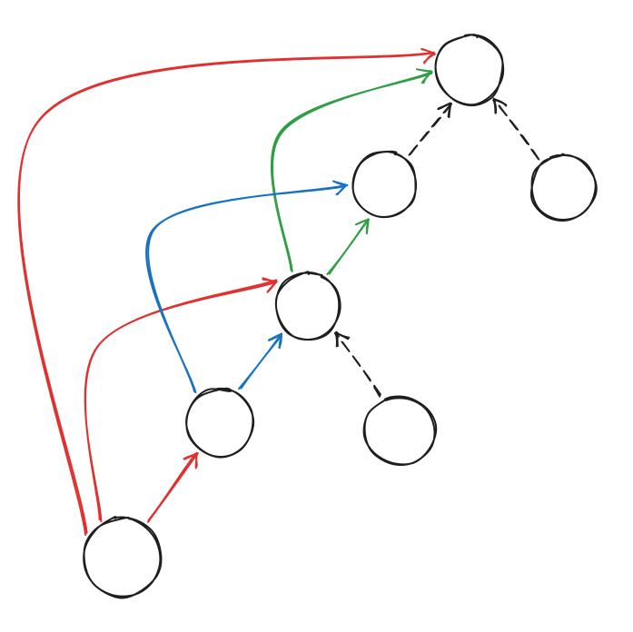

# Binary Lifting

A way to answer ancestor-related queries on a tree in O(log n).

Most commonly: Given a node `u`, find its `k`-th ancestor.

## Core Idea

Each node stores references to:

* Its parent (1 step up)
* Its 2nd ancestor (2 steps up)
* Its 4th ancestor (4 steps up)
* Its 8th ancestor (8 steps up)
* etc.

To traverse to the `k`-th ancestor node of `u`, keep traversing up the tree with appropriate number of jumps until reaching the `k`-th ancestor (see "Traversing the Table" for more details).

> This is built upon the observation that any integer can be represented by a sum of powers of two.

## Building the Table

In practice, build a table `up` where `up[u][j]` is the `2^j`-th ancestor of `u`.

The first column stores each node's parent: `up[u][0] = parent[u]`

Then fill the rest of the table using: `up[u][j] = up[up[u][j - 1]][j - 1]` if the ancestor node exists.

> This works because the `2^j`-th ancestor can be reached by taking two consecutive `2^(j-1)` jumps.

## Traversing the Table

Examine the binary representation of `k`. Starting from the least significant bit, for each bit position `j` that is set, jump to `up[u][j]`.

For example, if: `k = 13 = 1101_2`

Then:

* Bit 0 is set: Jump up `1` step
* Bit 2 is set: Jump up `4` steps
* Bit 3 is set: Jump up `8` steps

## Applications

This precomputation can be used to compute LCA of any two nodes in a tree in O(log n) time.
