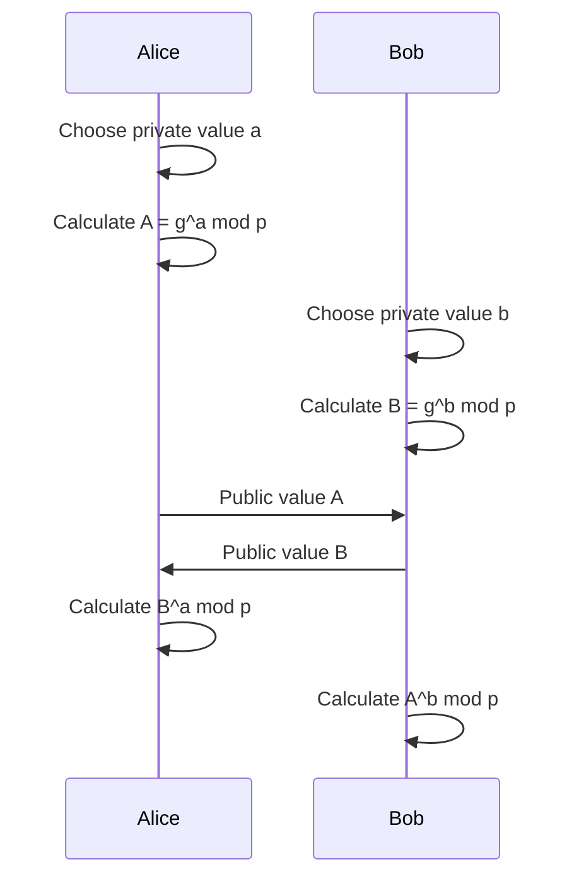

*Diffie-Hellman key agreement* allows two parties to establish shared secret key material over a public channel without transmitting the shared secret itself. The parties can then pass the result through a [[Key Derivation|key derivation function]] (KDF) to produce keys for symmetric encryption.

## Key Agreement and Key Transport

In *key agreement*, both parties contribute information and independently derive the same shared secret. Neither party selects the final secret or transmits it across the network. Diffie-Hellman is a key-agreement algorithm.

In *key transport*, one party generates the shared secret and securely sends it to the other party. Only the sender selects the secret; the recipient recovers the value rather than contributing to its creation.

## Finite-Field Diffie-Hellman

Alice and Bob agree on a public prime number $p$ and generator $g$. Alice chooses a private value $a$, and Bob independently chooses a private value $b$.

> There are published sets of $p$ and $g$ that are cryptographically secure. For example, RFC 7919 specifies standardized finite-field DH groups called `ffdhe2048`, `ffdhe3072`, `ffdhe4096`. Generally, we use one of these existing sets instead of creating our own.

Computing $g^a \bmod p$ is known as *modular exponentiation*, and is the basis of this algorithm. It can be performed efficiently even when the numbers are large.

The following sequence shows the complete exchange:

The pair $(a, A)$ is Alice's *DH key pair*: $a$ is the private key, and $A = g^a \bmod p$ is the corresponding public key. Protocol descriptions may also call $A$ a *DH public value* or *DH key share*. Similarly, Bob's key pair is $(b, B)$.

Both calculations produce the same shared secret:

$$
(g^a \bmod p)^b \bmod p = (g^b \bmod p)^a \bmod p = g^{ab} \bmod p
$$

The private values $a$ and $b$ never cross the network.

### Discrete Logarithm Problem

Recovering $a$ from $g^a \bmod p$ is an instance of the *discrete logarithm problem (DLP)*:

$$
g^a \bmod p \longrightarrow a
$$

For appropriately chosen cryptographic groups and parameters, no efficient classical algorithm is known for solving the discrete logarithm problem.

### Computational Diffie-Hellman Problem

An attacker does not need to recover either private key if they can calculate the shared secret directly. Given the two public values, the *Computational Diffie-Hellman (CDH) problem* is to calculate $g^{ab} \bmod p$:

$$
g^a \bmod p,\ g^b \bmod p \longrightarrow g^{ab} \bmod p
$$

Solving the DLP would also solve the CDH problem because recovering either private key makes it possible to calculate the shared secret.

Diffie-Hellman relies directly on the CDH problem being computationally infeasible.

### Selecting $p$ and $g$

The modulus $p$ is chosen as a large prime. In the simple full-group form of DH, the possible outputs range from $1$ through $p - 1$, so a larger $p$ provides a larger search space and makes attacks on the discrete logarithm problem more difficult.

After choosing $p$, the generator $g$ must be selected to generate a sufficiently large subgroup. In the simple full-group construction, $g$ can be a primitive root modulo $p$, meaning that $g^x \bmod p$ can produce every value from $1$ through $p - 1$ as $x$ varies. Practical DH parameter sets may instead deliberately use a large prime-order subgroup. A poor choice of $g$ generates only a small subgroup and reduces the effective search space regardless of how large $p$ is.

For example with $p = 19$, different choices of $g$ produce the following sets as the exponent $x$ varies:

| Generator | Possible values of $g^x \bmod 19$ | Number of values |
| --- | --- | --- |
| $g = 1$ | $\{1\}$ | $1$ |
| $g = 4$ | $\{1, 4, 5, 6, 7, 9, 11, 16, 17\}$ | $9$ |
| $g = 3$ | $\{1, 2, \ldots, 18\}$ | $18$ |

The choice $g = 1$ is unusable because $1^x \bmod p = 1$ for every exponent, so every shared secret would be known in advence (which could be used in brute force attacks). The choice $g = 4$ generates a subgroup containing only half of the available nonzero values. By contrast, $g = 3$ is a *primitive root modulo $19$*: its powers generate every nonzero residue from $1$ through $18$.

## Man-in-the-Middle Attacks

Diffie-Hellman does not authenticate either party and is therefore vulnerable to a [[Certificates and PKI|man-in-the-middle (MITM) attack]]. The attacker replaces both public values and establishes a separate shared secret with each party, allowing them to decrypt messages received through one connection and re-encrypt them for the other.

Preventing this attack requires authentication that binds each DH public value to the expected identity. A [[Digital Signature|digital signature]] is one way for a protocol to provide that binding.

## Static and Ephemeral Keys

A *static DH key* is a private and public key pair reused across multiple DH exchanges. The same key might be reused when connecting to many peers, or it might be maintained specifically for repeated communication with one peer. The defining property is reuse.

An *ephemeral DH key* is generated for one key exchange and is not reused in later exchanges. Once the DH shared secret has been calculated, the ephemeral private key is no longer needed and can be discarded immediately, potentially before the network connection closes.

The DH shared secret is passed through the KDF to produce the keys used by the protocol. The DH shared secret can be discarded after those keys have been derived. The derived traffic keys remain available while they are needed and are discarded when their connection or key epoch ends.

### Forward Secrecy

Using fresh ephemeral keys and deleting their private components enables *forward secrecy*.  It ensures that compromising a long-term private key does not allow an attacker to recover session keys from previously completed sessions.

Forward secrecy therefore limits the historical data exposed when a long-term key is compromised.

> In the context of static DH, the reused secret key $a$ is the long-term key. If an attacker records Bob's public value $B = g^b \bmod p$ and later obtains $a$, they can calculate $B^a \bmod p = g^{ab} \bmod p$ and recover the shared secret. Therefore, static DH does not provide forward secrecy.

## Elliptic-Curve Diffie-Hellman

*Elliptic-Curve Diffie-Hellman (ECDH)* performs the same key-agreement role as finite-field Diffie-Hellman but uses a different mathematical group. It replaces modular exponentiation with elliptic-curve operations that have the same important property: deriving a public key and shared secret is efficient, but reversing the operation to recover a private key is computationally infeasible.

The exchange retains the same overall shape. Each party generates a private key, derives and exchanges a corresponding public key, and combines its private key with the other party's public key to obtain the same shared secret.

ECDH provides comparable security with much smaller parameters and public keys than finite-field DH:

| Key agreement | Typical parameter or key size | Approximate security |
| --- | --- | --- |
| Finite-field DH | 2048 bits | 112 bits |
| Finite-field DH | 3072 bits | 128 bits |
| ECDH with a 256-bit curve | 256 bits | 128 bits |

The smaller values reduce network bandwidth and storage and can improve performance, depending on the implementation and platform.

Similar to finite-field Diffie-Hellman, ECDH parameters are selected from standardized, reviewed sets rather than created by application developers.

ECDH performed with ephemeral keys is called *Ephemeral Elliptic-Curve Diffie-Hellman (ECDHE)*.
