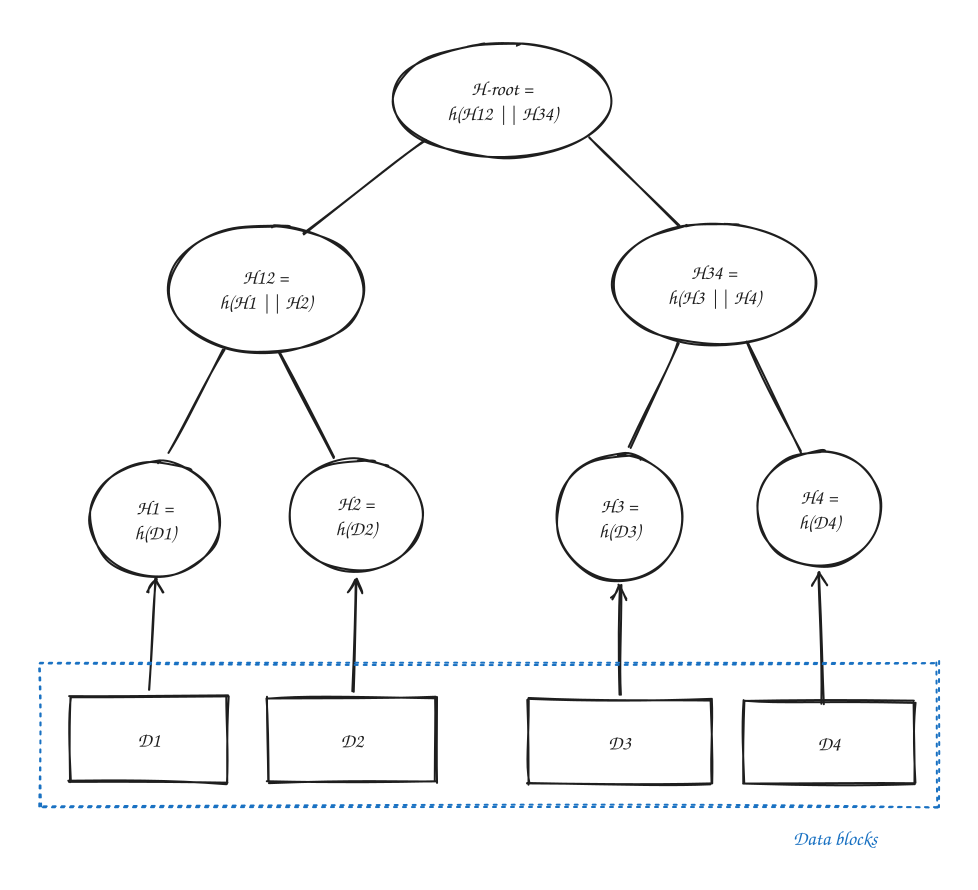

# Merkle Tree



Also known as a hash tree. It is a tree data structure that labels nodes with cryptographic hashes:

- Leaf node: Labelled with hash of a data block
- Inner node: Labelled with hash of the labels of child nodes

Merkle trees don't need to be binary, and inner nodes could also store data blocks. The concatenation function just needs to be able to handle these.

> In general, our hashing process can be described as `label = h(f(left, right))`. Note that the most common/universal combining function is simply concatenation: `f(A, B) = A || B`, although any combining function `f` is possible, provided they preserve the desired security properties. `h` is the hash function.

## Verification and Merkle Proofs

Demonstrating that a leaf node is part of a given Merkle tree requires `O(log n)` hash computations, where `n` is the number of leaf nodes (for a balanced tree.)

> We say `n` is number of leaf nodes, but asymptotically `n` could also mean the total number of nodes. However, it commonly refers to leaf nodes in papers/articles as data blocks are conventionally stored in leaves, and thats the quantity users care about.

A Merkle proof is the set of sibling hashes required to reconstruct the path from a leaf node to the root hash.

In the example above, to prove that `D1` is correctly part of the tree, we must compute:

```text
H1 = h(D1)
H12 = h(H1 || H2), assuming H2 is already known
H-root = h(H12 || H34), assuming H34 is already known
```

The proof consists of the hashes `[H2, H34]`.

> One might wonder why an attacker cannot simply fabricate a Merkle proof for malicious data. The security of Merkle trees comes from the underlying cryptographic hash function: given a trusted root hash, finding a different data block and proof that produce the same root is assumed to be computationally infeasible.

## Applications

A Merkle tree allows verification of a small piece of data without downloading or hashing the entire dataset. To verify a leaf, only its Merkle proof and the trusted root hash are needed.

Thus, they are widely used in applications like: distributed version control systems (Git), crypto networks (Bitcoin, Ethereum), package managers (Nix) etc.

For example, in P2P networks:

- A trusted source provides the Merkle root hash.
- File chunks and Merkle proofs can be downloaded from untrusted peers.
- Each chunk can be verified independently by hashing the chunk and combining it with its Merkle proof to reconstruct the root hash.
- The reconstructed root hash is compared against the trusted root hash.
  - Chunks with valid proofs are kept.
  - Corrupted or malicious chunks are discarded and re-downloaded from other peers.

Thus, Merkle trees enable efficient integrity checking of large downloads: only invalid chunks need to be re-downloaded, while valid chunks can be kept.

## Domain Separation

Some Merkle tree implementations distinguish leaf and internal nodes when hashing:

```text
leaf = h(0x00 || data)
internal = h(0x01 || left || right)
```

This prevents ambiguity between leaf and internal-node hashes and avoids second-preimage attacks.

> Without domain separation, a hash representing an internal node could be interpreted as leaf data. This can allow an attacker to construct a different tree with the same root hash
