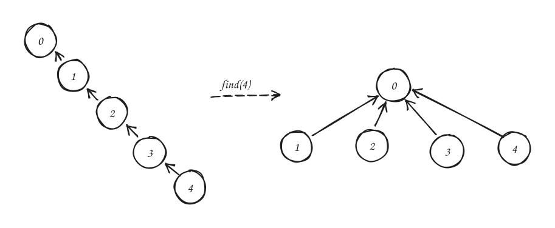

# Union Find Disjoint Set

Union-Find Disjoint Set (UFDS), also known as Disjoint Set Union (DSU), is a data structure for maintaining a collection of disjoint sets.

It commonly supports two operations:

- `find(x)`: Return the representative/root of the set containing `x`.
- `union(a, b)`: Merge the sets containing `a` and `b`.

A naive implementation stores each set as a rooted tree, where every node points to its parent and the root points to itself.

```python
class UFDS:
    def __init__(self, n):
        self.parent = list(range(n))

    def find(self, x):
        while self.parent[x] != x:
            x = self.parent[x]
        return x

    def union(self, a, b):
        ra = self.find(a)
        rb = self.find(b)

        if ra != rb:
            self.parent[ra] = rb
```

The problem with this implementation is that `union` can arbitrarily create tall trees. And `find` must repeatedly walk tall trees to find the set representative.

## Path Compression

Path compression optimizes `find`.

Whenever we call `find(x)`, all nodes visited on the way to the root are directly attached to the root.

```python
def find(self, x):
    if self.parent[x] != x:
        self.parent[x] = self.find(self.parent[x])
    return self.parent[x]
```

For example, given:



Path compression does not avoid the cost of walking to the root the first time. It only makes future queries cheaper. It fixes bad trees after we access them, but it does not prevent bad trees from forming in the first place.

## Union by Rank

Union by rank optimizes `union`.

Instead of arbitrarily attaching one root under another, we try to keep the tree shallow.

The `rank` of a root is an upper bound on the height of its tree. When merging two sets:

- Attach the lower-rank root under the higher-rank root.
- If both ranks are equal, choose either root and increment its rank.

```python
class UFDS:
    def __init__(self, n):
        self.parent = list(range(n))
        self.rank = [0] * n

    def find(self, x):
        ...

    def union(self, a, b):
        ra = self.find(a)
        rb = self.find(b)

        if ra == rb:
            return

        if self.rank[ra] > self.rank[rb]:
            self.parent[rb] = ra
        else:
            self.parent[ra] = rb
            if self.rank[ra] == self.rank[rb]:
                self.rank[rb] += 1
```

> The rank is not necessarily the true height after path compression. Once path compression rewires nodes directly to the root, the actual tree height may decrease, but the rank is usually left unchanged. It remains a useful approximation for future unions.

## Path Compression vs Union by Rank

### Why Path Compression Alone May Be Enough Sometimes

At first, it seems like union by rank should always matter. But in some problems, path compression alone is practically enough.

Consider a problem where we first process all edges, then finally call `find` on every vertex once:

```python
for u, v in edges:
    ufds.union(u, v)

for u in range(n):
    root = ufds.find(u)
```

Even if the union operations create a terrible chain, the final loop touches every vertex anyway. The first expensive `find(0)` walks the entire chain and compresses it. After that, most later calls are cheap.

The total work is still roughly linear in the number of vertices.

In this access pattern, the expensive traversal is not as wasteful because we were going to touch every vertex anyway. That is why in some solutions, not implementing union by rank could lead to similar runtime performance.

> An example of such a problem: [Count the Number of Complete Components](https://leetcode.com/problems/count-the-number-of-complete-components/).

### When Union by Rank Matters

Now consider a different access pattern.

Suppose the union operations create a long chain:

```text
0 <- 1 <- 2 <- 3 <- ... <- 999999
```

Then the only query we care about is `find(999999)`.

Without union by rank, this single query must traverse the entire chain.

If we were never going to touch the intermediate vertices otherwise, then traversing them is pure overhead.

With union by rank, the tree would never become such a tall chain in the first place. The representative can be reached much more quickly.

So the distinction is:

- Path compression reduces the cost of future accesses.
- Union by rank reduces the cost of the first access by preventing tall trees from forming.

## Performance Comparison

Let `n` be the number of elements and `m` be the number of operations.

| Optimization | Intuition | Worst-case behavior |
| --- | --- | --- |
| None | Trees may become long chains. | `find` can be `O(n)`. |
| Path compression only | Bad trees are flattened after being accessed. | Individual `find` can still be expensive before compression. |
| Union by rank only | Bad trees are prevented from forming. | `find` is `O(log n)`. |
| Union by rank + path compression | Trees are kept shallow and flattened over time. | Amortized `O(α(n))` per operation. |

`α(n)` is the inverse Ackermann function. For all practical input sizes, it is effectively a very small constant.

## Union by Rank Variants

There are a few common variants of the same idea.

### Union by Rank

Union by rank stores an approximate height for each root.

```python
if rank[ra] > rank[rb]:
    parent[rb] = ra
else:
    parent[ra] = rb
    if rank[ra] == rank[rb]:
        rank[ra] += 1
```

The rank only increases when two trees of equal rank are merged.

### Union by Size

Union by size stores the number of nodes in each component.

```python
if size[ra] < size[rb]:
    ra, rb = rb, ra

parent[rb] = ra
size[ra] += size[rb]
```

When merging two sets, attach the smaller component under the larger component.

> For problems that already need to store the set/component size, it is more convenient to implement union by size instead.

### Arbitrary Union

Arbitrary union simply attaches one root under another.

```python
parent[ra] = rb
```

This is the simplest version, but it gives the weakest guarantees.

With path compression, it may still be fine for many offline problems where all vertices are eventually touched. However, it is less safe for general-purpose UFDS usage.
