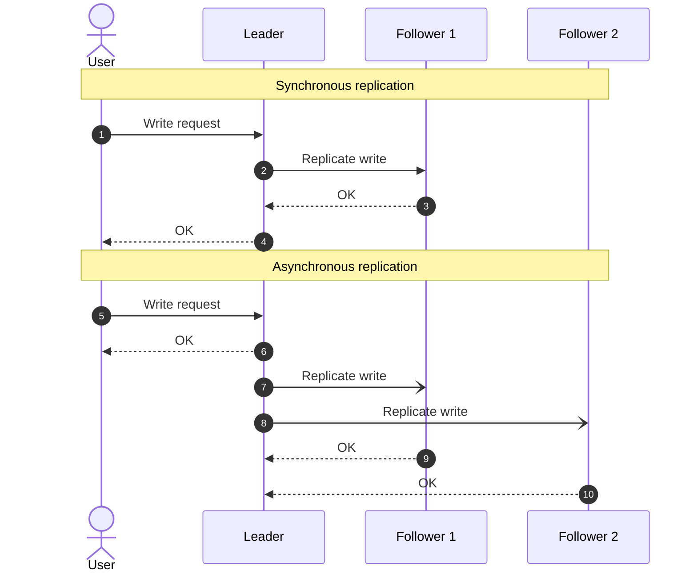
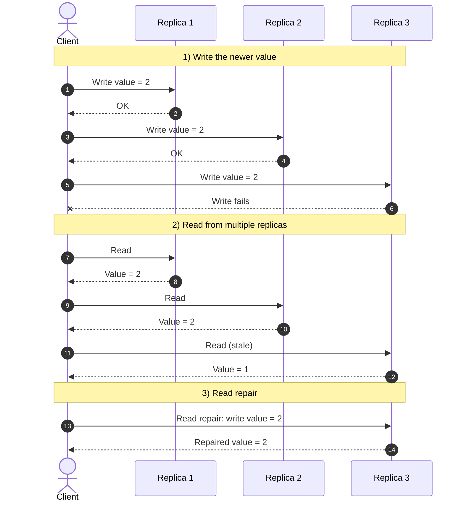
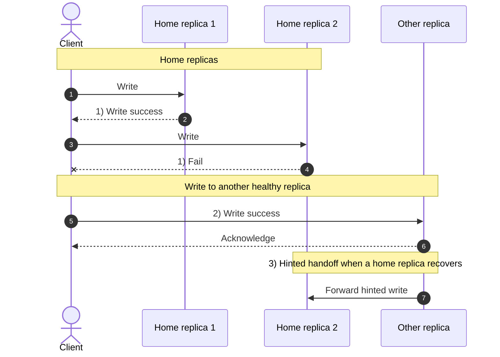

*Database replication* is the process of keeping copies of the same data on multiple machines connected over a network.

Each machine that stores a copy of the data is called a *replica*.

Replication provides several benefits:

- Replication reduces latency by keeping data geographically close to users.
- Replication improves availability by continuing to serve requests if some machines fail.
- Replication increases read throughput by serving read requests from multiple replicas.
- Replication improves durability by keeping redundant copies of data.

> A replica is not necessarily a copy of a "main" database. The primary database is also a replica. "Replica" simply means a node that stores a copy of the replicated data.

Replication delay and independent writers lead to the guarantees discussed in [[Eventual Consistency]] and the reconciliation strategies in [[Write Conflicts]].

## Synchronous and Asynchronous Replication

The following sequence diagram contrasts when *synchronous replication* and *asynchronous replication* report a write as successful:



Synchronous replication waits for an acknowledgement from at least one follower before reporting success, whereas asynchronous replication reports success without waiting for followers.

| Replication Mode | Benefit | Cost |
| --- | --- | --- |
| Synchronous | A confirmed write exists on more than one replica. | Writes are slower. If one of the synchronous followers is unavailable, the entire network is blocked from receiving writes. |
| Asynchronous | Writes can continue even if followers are slow or unavailable. | Recent writes may be lost if the leader fails before followers receive them. |

In practice, systems often use a mix of both. For example, one follower may be synchronous while other followers are asynchronous.

This gives the system at least two up-to-date copies of committed data without requiring every follower to acknowledge every write.

> This is sometimes called semi-synchronous replication, but the exact meaning differs.

## Single-Leader Replication

The following diagram shows how a single leader receives writes and replicates them to followers:


The leader establishes the write order, and followers apply the resulting changes in that order.

In *single-leader replication* (also called active-passive replication or master-slave replication), one replica is designated as the leader.

All write requests are sent to the leader. The leader writes the change locally, then sends the change to the other replicas through a replication log or change stream.

The other replicas are called followers. They apply the changes from the leader in the same order, so they eventually store the same data.

### Setting Up a New Follower

A new follower can't usually start by reading the leader's data file while writes are happening. The data might change halfway through the copy.

Instead, a typical setup process is:

1. Take a consistent snapshot of the leader's database.
2. Copy the snapshot to the new follower.
3. Record the replication log position corresponding to the snapshot.
4. Ask the leader for all replication log entries after that position.
5. Apply the backlog until the follower catches up.

### Follower failure: Catch-up Recovery

A follower can remember the last replication log position it processed. When it restarts, it asks the leader for all changes after that position.

### Leader failure: Failover

If the leader fails, one of the followers must be promoted to become the new leader. Clients must start sending writes to the new leader, and other followers must start replicating from it. This process is called failover.

A typical failover process is:

1. Detect that the leader has failed. Most systems use timeout-based failure detection: nodes exchange messages, and a node is assumed dead if it is unreachable for a period.
2. Choose a follower to become the new leader. To minimize data loss, especially in asynchronous replication, the follower with most up-to-date data is promoted.
3. Reconfigure clients and followers to use the new leader.

There are several problems:

- False failure detection: A node may appear dead because of a network problem, even though it is still running.
- Data loss: If replication is asynchronous, the old leader may have accepted writes that no follower received, causing data loss on failover.
- Split brain: The old leader may come back online and still believe it is the leader.

Automatic failover usually requires some form of coordination or consensus, otherwise manual failover is safer.

## Multi-Leader Replication

The following diagram shows how multiple leaders accept local writes and replicate them to one another:


Each leader establishes a local write order, so concurrent writes may need to be reconciled.

In *multi-leader replication*, more than one replica can accept writes. Each leader processes local writes and replicates those writes to the other leaders.

> This doesn't mean every replica must accept writes. A common deployment is to have one write-accepting leader per cluster, with read-only followers inside each cluster. The leaders replicate writes to each other, while local followers replicate from their cluster's leader.

The main benefits are:

- Lower write latency for geographically distributed users.
- Better availability if one replica is unavailable.
- Better tolerance of network interruptions between replicas.

> Clients with offline operation are a form of multi-leader replication. For example, a calendar app that syncs to cloud, but also works offline.

### Multi-Leader Topologies

The following diagram compares circular, star, and all-to-all multi-leader topologies:


Circular and star topologies are simpler, but one failed node can interrupt replication between other nodes.

All-to-all topologies are more fault-tolerant, but they need to avoid sending the same write around forever.

To solve this, each write (replication log record) can carry metadata of the set of replicas that have already seen the write. When a replica receives a write it has already processed, it ignores it.

Conceptually, the record can have a "seen-by" set consisting of replica IDs. If a replica's ID is in the "seen-by" set, skip processing and stop propagating the write.

## Leaderless Replication

The following diagram shows how a leaderless system sends a request to multiple replicas without routing every write through one leader:


Because no single leader establishes the order, replicas may need versions, timestamps, or conflict-resolution rules to reconcile writes.

In *leaderless replication*, there is no special leader that accepts all writes. Instead, a write (and also read) is sent to multiple replicas.

In some systems, the client sends writes directly to several replicas. In other systems, a coordinator node does this on behalf of the client.

> A coordinator may help send one request to several replicas, but it is not the single authority that all writes pass through. Thus, even with a coordinator, leaderless replication has no single leader-defined write order.

| Model | Who orders writes? |
| --- | --- |
| Single-leader | One leader defines the write order. |
| Multi-leader | Each leader defines a local write order for its cluster; conflicting or concurrent writes must be reconciled later. |
| Leaderless | No leader defines the write order; replicas rely on versions, quorums, timestamps, or conflict resolution. |

The difference between multi-leader and leaderless is that the write is accepted by multiple replicas, rather than being first accepted by one leader and then replicated outward.

> For an accessible explanation of many concepts in this chapter, see [this replication overview](https://youtu.be/Jy4Cm2WEZVg?si=wcMR6LTNwQLfBiAS). The rest of the note draws mainly from that playlist and the DDIA book.

### Read Repair

The following sequence diagram shows how a client can repair a stale replica after observing a newer value:



When a client reads from multiple replicas, it may notice that one replica has an older value. The client can then write the newer value back to the stale replica. This is called *read repair*.

Read repair updates the stale replica as part of a read, but it doesn't repair values that clients never read.

### Anti-Entropy

*Anti-entropy* is a background process that compares replicas and repairs differences. It is often bidirectional: replicas exchange missing or newer data so they converge toward the same state.

Unlike replication logs, anti-entropy doesn't necessarily copy every write in the original order. For example, the replicas could be in the following state:

```text
Replica A:
id_1 = "foo"
id_2 = "bar"
id_3 = "qux"

Replica B:
id_1 = "baz"
id_3 = "qux"
id_4 = "quxx"
```

To repair replicas A and B, identify that `id_1` differs, that `id_2` exists on A but not B, and that `id_4` exists on B but not A. Then repair only those rows; `id_3` is skipped entirely.

A naive approach would compare every row between two replicas, but this is expensive.

A common optimization is to use [[Merkle Tree|Merkle trees]]. Each replica builds a Merkle tree over the same key ranges. Each leaf summarizes a small range of rows, and each parent summarizes its child ranges.

To compare two replicas:

1. Compare the root hash.
2. If the root hashes are equal, the replicas match for that key range.
3. If the root hashes differ, compare the child hashes.
4. Repeat until the differing key ranges are found.
5. Exchange and repair only the rows in those ranges.

This avoids transferring the entire dataset just to find a small number of differences. This process doesn't use Merkle proofs.

> Merkle trees don't decide which replica is correct. They only help find differences efficiently. The system still needs rules for conflict resolution.

### Quorum Consistency

The following diagram illustrates how quorum reads and writes can overlap on at least one replica:


Leaderless systems often use *quorum reads and writes*. Let $n$ be the number of replicas, $w$ the number of replicas that must acknowledge a write, and $r$ the number of replicas queried for a read.

The quorum condition is defined as:

$$
w + r > n
$$

This ensures that the read set and write set overlap in at least one replica.

> Quorum reads don't use majority vote to decide the value. If two replicas return different values, the system usually chooses the value with the newest version, timestamp, or causal metadata.

### Quorum Doesn't Guarantee Strong Consistency

But the quorum condition alone doesn't guarantee strong consistency. There are several reasons:

- Reads and writes may happen concurrently. A read may overlap with a write that has reached some replicas but not others yet.
- Concurrent writes may still happen.
- Sloppy quorum may break the quorum condition.

So quorum reads and writes are better understood as a tunable consistency mechanism. Increasing $w$ makes writes more durable but slower. Increasing $r$ makes reads more likely to observe recent writes but slower. Decreasing $w$ or $r$ improves availability and latency, but increases the chance of stale reads.

One may even set $w + r \leq n$ as needed.

### Sloppy Quorum

The following sequence diagram shows a write being stored temporarily on a non-home replica when a home replica is unavailable:



In normal quorum replication, a key has $n$ intended replicas. These are sometimes called the key's home replicas.

With a normal quorum, reads and writes are sent to those home replicas. With *sloppy quorum*, if one of the home replicas is unavailable, the system can send the write to another healthy node instead.

Later, when one of the home replicas becomes available again, the data is forwarded to it. This is called *hinted handoff*.

Sloppy quorum improves availability because writes can succeed even when some home replicas are unavailable. The cost is weaker consistency. Even if $w + r > n$, a later read from the original home replicas may miss a write that was temporarily stored somewhere else.

## Replication Logs

Replication usually needs some representation of changes that can be sent between replicas.

### Statement-Based Replication

In *statement-based replication*, the leader logs every write statement (for example, `INSERT`, `UPDATE`, or `DELETE`) and sends it to followers. Each follower re-executes the same statement.

This can be compact because the statement may be smaller than the resulting row changes.

However, statement-based replication has problems with nondeterministic operations (for example, `RAND()` and `NOW()`) and side effects such as triggers and stored procedures that may behave differently on each replica.

### WAL Shipping

In [[Write Ahead Logging|write-ahead log]] shipping, the database sends records from its write-ahead log (WAL) to followers. This can be efficient because the database already writes WAL for durability and crash recovery.

This is a physical replication method. The problem is that the WAL describes data at a very low level, making replication coupled to the database's storage format.

WAL shipping usually requires the leader and followers to run compatible database versions. As a result, you can't always perform replica upgrades incrementally; instead, the entire network may need to be taken down for simultaneous upgrades.

### Logical Log Replication

*Logical log replication* (also called row-based log replication) uses a higher-level change format that is decoupled from the physical storage layout.

Instead of describing page-level storage changes, the log describes row-level changes:

- Row insert: The log contains new column values. For expressions such as `NOW()`, the database evaluates the expression before adding its value to the log record.
- Row delete: The log contains the row's primary key.
- Row update: The log contains the row's primary key and the new values of all changed columns.

Logical logs can be kept backward compatible and can be parsed by external systems.

### Trigger-Based Replication

*Trigger-based replication* uses database triggers to capture changes.

For example, a trigger can write changes into a separate table whenever a row is inserted, updated, or deleted. An external process can then read that table and replicate the changes elsewhere.

This approach is flexible because application-specific logic can be added. However, it usually has more overhead than built-in replication because it runs at a higher level and depends on trigger execution.
