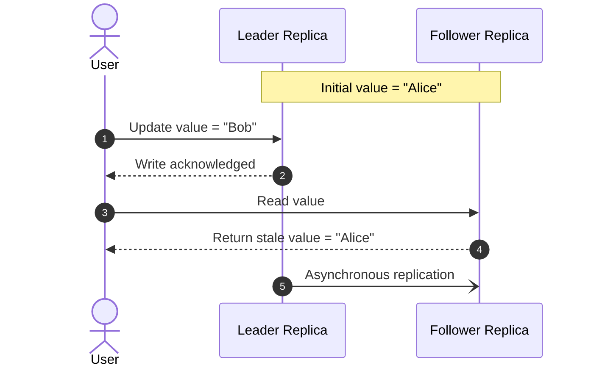
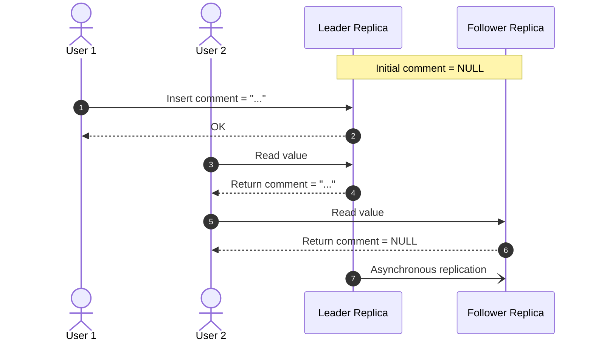
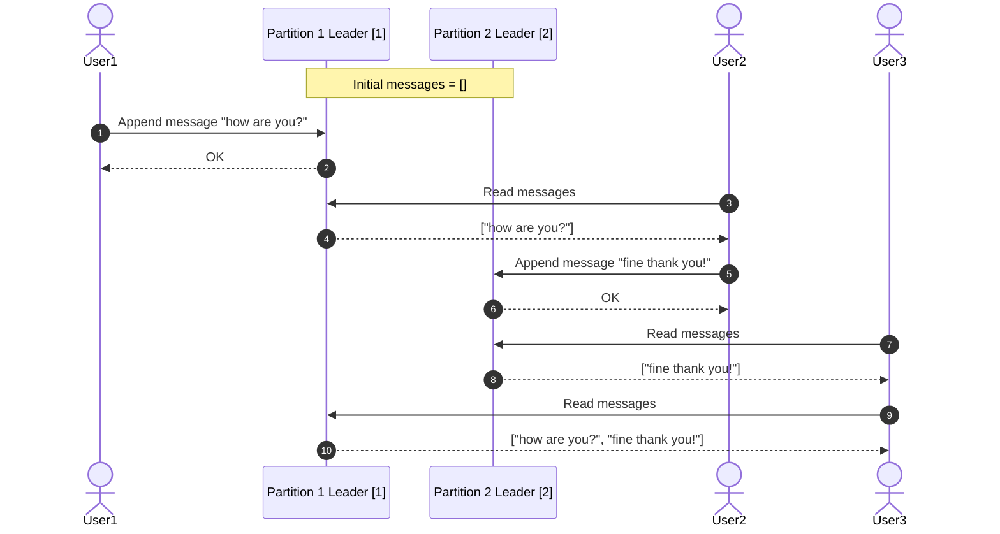
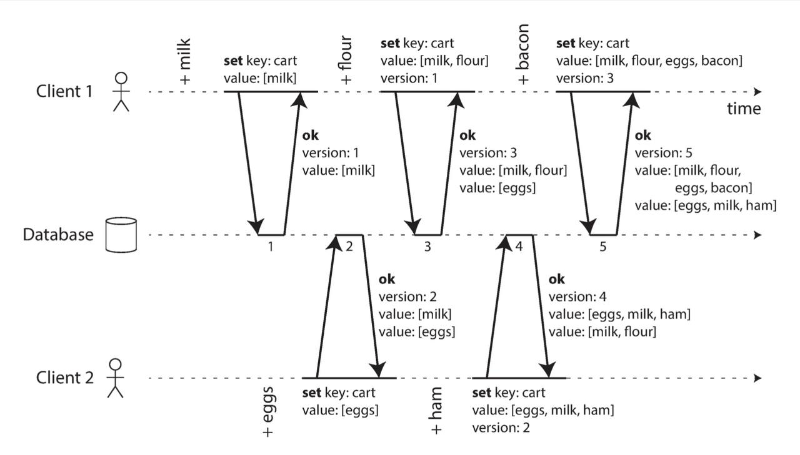
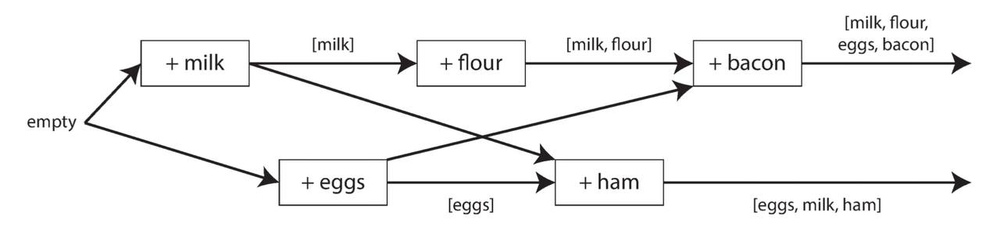

Eventual consistency is a consistency model where different replicas, caches, indexes, or derived views are allowed to temporarily disagree.

The main guarantee is eventual convergence: if no new writes occur, all non-faulty replicas should eventually converge to the same state.

Eventual consistency is often used to improve availability, latency, and throughput. Instead of synchronously coordinating every read and write across the whole system, different nodes can process operations independently and synchronize later.

Eventual consistency commonly creates two major problem categories:

1. Stale reads: A read observes an older version of data because the latest write has not reached every replica yet.
2. Concurrent writes: Multiple writes are accepted concurrently without immediate coordination, the system later needs to reconcile them.

## Stale Reads

Stale reads are allowed under eventual consistency. This is a tradeoff we accept for better availability, latency, or throughput. However, additional guarantees can make eventual consistency less confusing (discussed below.)

> Note that implementing the below guarantees does not "upgrade" an eventually consistent system to be strongly consistent, these are instead weaker guarantees that reduce the worst problems caused by eventual consistency.

### Read Your Own Writes

Read-your-own-writes consistency (or read-after-write consistency) means that after a user writes some data, that same user should be able to read their own update.

Without read-your-own-writes consistency, the system appears to have ignored or lost the user's action.

#### Solutions

One simple strategy to implement read-your-own-writes consistency is:

- Read user-editable data from the leader.
- Read other data from followers.

For example, on a social media site:

- A user reads their own profile from the leader.
- The same user reads other people's profiles from followers.

A more general strategy is to track the user's most recent write. For example:

1. The client remembers the timestamp or version of its latest write.
2. On future reads, the system only serves that client from replicas that have caught up to at least that timestamp or version.

This avoids always reading from the leader, but it requires the system to know how fresh each replica is.

> Read-your-own-writes becomes harder when the same user uses multiple devices. From the system's perspective, each device is its own client; but from the user's perspective, they are the same person. To handle this, the system may need to track the latest write at the user account level, not only at the client/session level.

### Monotonic Reads

Monotonic reads means that once a user has seen a certain version of data, they should not later see an older version. Without monotonic reads, time appears to move backward.

#### Solutions

A common strategy is to make sure the same user always reads from the same replica, at least for a period of time. For example, route reads based on user ID.

This gives the user a stable view of the system, because their reads are less likely to jump between replicas with different freshness levels.

Another strategy is to track the highest version the user has observed and only serve future reads from replicas that have reached at least that version.

This is similar to the read-your-own-writes strategy, but instead of tracking only the user's latest write, the client/session tracks both writes and reads.

### Consistent Prefix Reads

> [1] Stores messages for odd-numbered user IDs.  
> [2] Stores messages for even-numbered user IDs.

Consistent prefix reads means that if writes happen in a certain order, readers should not observe a later write without also seeing the earlier writes that it depends on.

In other words, users should not see effects before causes.

For example, if writes happened in order `W1 → W2 → W3`, a reader should only see a prefix of that order. Such valid prefixes include: `[]`, `[W1]`. `[W1, W2]` or `[W1, W2, W3]`; but invalid reads include `[W2]`, `[W1, W3]`, `[W3]` etc.

In the example above, the invalid read `["fine thank you!"]` appears for a moment, before it corrects to a valid prefix `["how are you?", "fine thank you!"]`. This is a violation of causality, "how are you?" causes "fine thank you!"; showing the effect ("fine thank you") without the cause ("how are you?") is a violation of causality.

> Consistent prefix reads are commmonly discussed with partitions, but it can happen with multi-leader or leaderless setups as well.

### Solutions

Solutions include mechanisms to keep track of causal dependencies, and ensuring causally related data is written to the same partition.

In the example above, a solution would be to recognize that messages within a chat log are causally dependent, thus should be stored within a single partition.

> Strictly speaking, not every message in a chat is causally dependent on every other message. Two unrelated conversations may happen in the same chat at the same time, and their relative ordering may not matter. However, storing the whole chat in one partition is a sane simplification: it preserves a total order for the chat log, which is stronger than preserving only the causal order.

## Concurrent Writes

### Causal Dependencies in Replication

In replication, a write is [[Time|causally dependent]] on another write when a client creates it after observing the earlier write.

The following example from DDIA shows those dependencies in a replicated system:

Their causal dependency graph is as follows:

The following causal-dependency algorithm uses this distinction to decide whether an incoming write replaces an existing value or must be kept as a concurrent sibling.

### Simple Algorithm to Detect Causal Dependency

The database stores, for each key:

- A current version number
- One or more current values

A client should read before writing, and when it writes, it must include the version number it previously read.

The server uses the submitted version number to decide whether the new write overwrites old values or conflicts with existing values.

When a write arrives with version N:

1. The server treats the write as being based on all values at version N or below.
2. The server can discard values whose versions are $\leq N$, because the client has seen and replaced them.
3. The server must keep values whose versions are $> N$, because those values were created after the client's read and are therefore concurrent with the client's write.
4. The server assigns a new version number (current version number + 1) to the new value.
5. The server returns all current sibling values to the client. (This step can be skipped if we ensure client always reads before writing.)

This algorithm identifies causal dependencies but still requires one of the resolution strategies in [[Write Conflicts]].

> This algorithm can be seen in the "Causality Example 1" sequence diagram above. It stores one or more current values because conflict resolution is assumed to happen in the application. Database-layer approaches such as CRDTs can resolve those values within the data type instead.

### Version Vectors in Replication

A version vector is a [[Time|vector clock]] attached to a particular data item or version.

In a database, the vector records which updates this value already includes. When a replica receives another version of the same item, it applies those rules to decide whether the incoming version supersedes the local value, is stale, or is concurrent. Concurrent versions must be kept as siblings or resolved using a strategy from [[Write Conflicts]].

## Strong Eventual Consistency

Basic eventual consistency says replicas should eventually converge, but it does not always explain how convergence is guaranteed when updates arrive in different orders.

Strong eventual consistency is a stronger form of eventual consistency. It requires two properties:

1. Eventual delivery: Every update made at one non-faulty replica is eventually delivered to every other non-faulty replica.

2. Convergence: Any two replicas that have processed the same set of updates are in the same state, even if they processed those updates in different orders.

CRDTs are one way to obtain this property; see [[Write Conflicts]].
