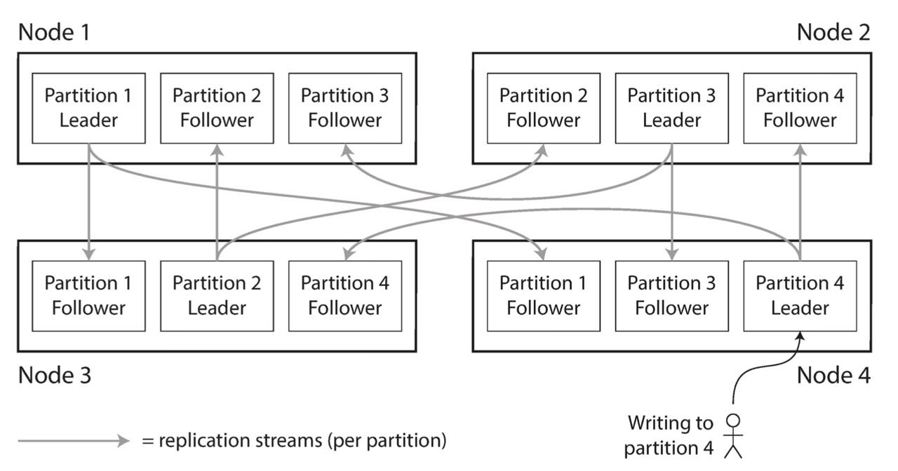

<!-- TODO: Link to request routing note when ready -->

Partitioning, also called sharding, divides a logical database into smaller, independent parts. Each part is called a partition or shard.

The goal is to spread data and load across multiple nodes so that the system can scale beyond the capacity of a single node. Partitioning is usually combined with [[Database Replication|replication]]: each partition has multiple replicas for fault tolerance and availability.



In the example above, one partition is replicated across three nodes, providing fault tolerance.

## Types of Partitioning

### Horizontal Partitioning

Horizontal partitioning divides rows between partitions. In distributed systems, this is usually what "partitioning" or "sharding" refers to: different partitions hold different subsets of the records.

### Vertical Partitioning

Vertical partitioning (also called "row splitting", since rows are split by columns) divides columns, for example by moving large or infrequently accessed columns into a separate table.

This is often discussed as database normalization, but vertical partitioning can still be applied on an already normalized database.

## Partitioning Strategies

Some terminology: when partitioning causes some partitions to contain more data than others, this is called skewed partitioning. A partition with a disproportionately high load is called a hot spot.

### Range Partitioning

Range partitioning assigns a continuous range of keys to each partition. The ranges do not need to contain the same number of keys; they should contain roughly the same amount of data and traffic. For example, one partition contains words beginning with A–B, and another contains words beginning with T–Z, because words are not distributed evenly across the alphabet.

Keys can be kept in sorted order within each partition, which makes range queries efficient and preserves data locality.

The downside is that some access patterns create hot spots. For example, partitioning a log by timestamp sends all new writes to the partition containing the current time.

> Partition pruning is a query optimization technique that makes use of range partitions to skip irrelevant partitions entirely, speeding up the query.

### Hash Partitioning

A well-chosen [[Hashing|hash function]] can distribute keys evenly, and partition boundaries can be evenly spaced. This is basically applying a hash function and then partitioning by key range over the hash output.

The downside is that hashing destroys key order and data locality. A range query may need to read from every partition and combine the results.

### List Partitioning

List partitioning assigns specific values to a partition. For example, all rows where the column Country is either Iceland, Norway, Sweden, Finland or Denmark could build a partition for the Nordic countries.

This is useful when the application already has meaningful categories. The categories do not need to be contiguous.

The mapping must be maintained as new values appear. A value that is not included in any list needs a default partition.

> Default partition: A partition that captures data falling outside the defined ranges or values specified for other partitions.

### Round-robin Partitioning

Round-robin partitioning assigns records in insertion order across partitions. With `N` partitions, record `i` is assigned to partition `i mod N`.

This provides an even distribution and can parallelize sequential access, but a query for a specific record usually needs to check every partition.

Round-robin partitioning is therefore mainly useful when the workload is dominated by scans or batch processing, such as `SELECT AGGREGATE FROM TABLE` queries where every partition would have been scanned anyway. It is a poor fit for point lookups and OLTP databases.

### Composite Partitioning

Composite partitioning combines multiple strategies. For example, a database might first partition by key range and then partition each range by hash.

The order of the strategies matters, for example:

| Aspect | Range → Hash | Hash → Range |
|--------|--------------|--------------|
| First partitioning step | Partition by key range | Partition by hash |
| Second partitioning step | Hash within each range | Partition by range within each hash bucket |
| Point lookups | Efficient | Efficient |
| Range queries | Efficient. Only the relevant top-level range needs to be scanned. | Inefficient. The query must visit every hash bucket because each contains its own ranges. |
| Write distribution | Better than pure range partitioning, though hot ranges can still exist | Excellent. Hashing evenly distributes writes before any further partitioning. |
| Typical use cases | Time-series, logs, orders, event data | Rarely used in practice. |

### Directory-Based Partitioning

Directory-based partitioning uses a lookup table to map keys to a partition. This makes the placement policy flexible, but the directory becomes another piece of metadata that must be stored, updated, and made highly available.

Benefits include:

- Any key can be moved independently
- Easy to isolate large tenants ("whales") to their own partitions
- Flexible for rebalancing

The main drawback is that the directory needs to be kept updated and available to clients.

> Tenant-aware data partitioning is a multi-tenant SaaS architecture where data storage is deliberately partitioned by a `tenant_id`. This strategy allows systems to route queries, scale resources, and apply rate limits based strictly on the tenant, i.e. implicit rate limiting per tenant by partitioning.

## Choosing a Partition Key

The partitioning key should distribute load evenly and align with the application's most common access patterns.

### Partition Key vs Primary Key

In many distributed databases, the partition key and primary key serve different purposes:

- The partition key determines where a row is stored by choosing which partition owns it.
- The primary key uniquely identifies the row.

Some databases such as Cassandra require partition key to be part of the primary key via a compound primary key:

```sql
-- user_id is the partition key; update_timestamp is a clustering column and not part of the partition key
PRIMARY KEY ((user_id), update_timestamp);
```

This allows all posts from the same user to be stored together while remaining sorted by timestamp, making queries such as "all posts from this user within a time range" efficient.

In other databases, such as PostgreSQL, partition keys don't have to be part of the primary key:

```sql
PRIMARY KEY (order_id);
PARTITION BY RANGE (order_date);
```

### Splitting a Hot Key

A single popular key can still create a hot spot. For example, a celebrity's post may receive a large volume of comments.

One application-level technique is to append a random bucket number to the key. Writes are then spread across several partitions. Reads must query all possible buckets and merge the results; this trades write load for read complexity.

## Secondary Indexes

### Partitioning by Document


Also known as a local secondary index. Each partition maintains its own secondary index.

This approach keeps the index close to the data it describes. Updating a document only requires updating the index in the document's own partition, which keeps writes relatively simple.

The tradeoff appears during reads. Range queries (non-point queries) must be sent to every partition, and the results must be combined. This is known as scatter/gather.

### Partitioning by Term


Also known as a global secondary index.

> The term comes from full-text indexes, where a term is a word that occurs in a document. In this context, a term is a specific key value. For example: `color:"red"`.

A global index is partitioned separately from the primary data. The index itself cannot live on one node because that would create a bottleneck and a single point of failure. Instead, the index itself is partitioned.

A lookup can then be routed to the index partition containing that term instead of querying every data partition. This requires no scatter/gather.

<!-- TODO: Link to distributed transactions when ready -->
Global indexes make writes more complicated: updating one document may require updates to several partitions. Keeping the index strongly consistent may require a distributed transaction, so many systems update global indexes asynchronously and expose [[Eventual Consistency|eventual consistency]].

|Aspect|Partitioning by document|Partitioning by term|
|---|---|---|
|Index location|Alongside the document's partition|In partitions separate from the documents|
|Range query|May require scatter/gather to all partitions|Access global index, then partitions holding the data|
|Write complexity|Lower; update one local index|Higher; one document may update several index partitions|

## Rebalancing Partitions

Rebalancing moves partitions between nodes when the cluster changes or the load becomes uneven. A good rebalancing strategy should:

- Distribute load evenly after rebalancing
- Keep accepting reads and writes during rebalancing
- Move as little data as possible to reduce network and disk I/O

### Hash Modulo N

A simple approach is to assign a key to `hash(key) % N`, where `N` is the number of nodes. This is easy to understand, but changing `N` causes almost every key to map to a different node. Rebalancing is therefore very expensive.

### Fixed Number of Partitions

Create many more partitions than nodes and assign several partitions to each node.

If a new node is added, it can take partitions from every existing node until partitions are fairly distributed again. If a node is removed, we reassign its partitions to every existing node.

> Only entire partitions are moved between nodes. The number of partitions and keys assigned to each partition does not change.

The maximum number of nodes is bounded by the number of partitions. A high number of partitions should be chosen to accommodate growth. However, too many partitions also create management overhead.

### Dynamic Partitioning

Dynamic partitioning splits a partition when it grows beyond a size threshold and merges partitions when they become too small. This keeps partition sizes within a target range.

A drawback is that if the database starts with one partition, most nodes may sit idle while the dataset is small. Systems can avoid this by pre-splitting, i.e. creating an initial set of partitions ahead of time.

### Fixed Partitions per Node

Another approach is to keep a fixed number of partitions per node.

If the number of nodes increases, the system splits existing partitions so the new nodes can take ownership of part of the data. This keeps partition size relatively stable as the cluster grows. In this model, partition count is proportional to node count rather than dataset size.

This is different from dynamic partitioning: partitions are not split because they exceed a size threshold, but because the cluster topology changes and the system needs to redistribute load.

> This method is described in DDIA, but there do not seem to be databases that actually use it.

### Automatic and Manual Rebalancing

Automatic rebalancing is convenient, but it can make failures worse, especially when combined with automatic failure detection. For example, a slow node may be mistaken for a failed node. The system starts moving its data, adding more load to the slow node, the remaining nodes, and the network. This can trigger a cascading failure.

### Consistent Hashing


Consistent hashing is a variation of hash partitioning designed to minimize the amount of data that must move during rebalancing.

Instead of mapping a key directly to a node, both keys and nodes are mapped onto the same hash space, represented as a ring.

To find the home node of a key:

1. Hash the key to obtain a position on the ring.
2. Walk clockwise until the first node is encountered.
3. That node, known as the key's successor, owns the key.

When a node joins or leaves the cluster, only the keys whose successor changes need to move. If the `n`th node is added, on average only about `1/n` of the keys are relocated.

The basic scheme has one drawback: if each physical node occupies only one position on the ring, a node failure transfers all of its keys to its immediate successor, potentially doubling that node's load.

To improve load balancing, most real systems assign each physical node multiple positions on the ring, known as virtual nodes (vnodes). When a node fails, the ranges owned by its virtual nodes are redistributed to different successors around the ring instead of a single machine. This spreads the additional load much more evenly across the cluster.

The node positions on the ring are typically stored in sorted order, allowing the successor of a key to be found efficiently using binary search.

| Operation     | Classic Hash Table | Consistent Hashing |
| ------------- | -----------------: | -----------------: |
| Add a node    |             `O(K)` |   `O(K/N + log N)` |
| Remove a node |             `O(K)` |   `O(K/N + log N)` |
| Lookup a key  |             `O(1)` |         `O(log N)` |
| Add a key     |             `O(1)` |         `O(log N)` |
| Remove a key  |             `O(1)` |         `O(log N)` |

Where `K` is the number of keys and `N` is the number of nodes.

Consistent hashing trades slightly slower lookups for dramatically cheaper rebalancing, making it well suited for distributed systems where nodes are frequently added or removed.

#### Placing VNodes

The original Dynamo (and many textbook definitions) simply chooses random positions for nodes. As a result, nodes can be grouped tightly, causing skew.

With later developments (vnodes), systems could still use random positions and get unlucky. In practice, each physical node has many vnodes. By the law of large numbers, the total range owned by each physical node becomes approximately equal.

In systems such as modern Cassandra, virtual nodes are assigned so that the ring is more evenly balanced.
