A transaction is a single unit of logic or work, made up of one or more operations.

Transactions concern the atomicity and isolation parts of ACID:

- Atomicity: A transaction should commit or abort atomically. If a transaction is aborted, all writes it made should be discarded.
- Isolation: [[Concurrency|Concurrent transactions]] shouldn't interfere with each other.

In general, storage engines aim to provide atomicity and isolation at the level of a single object. Atomicity is achieved by means of a [[Write Ahead Logging|write-ahead log]]; isolation can be achieved by locking objects (allowing only one thread to access an object at a time).

Some distributed databases avoid implementing multi-object transactions as they are difficult to implement across partitions. In theory all applications can be implemented without transactions, but would require extremely robust and complex error handling.

## Read Committed

Read committed is the most basic level of transaction isolation. It makes two guarantees:

1. No dirty reads: When reading, you will only see data that has been committed.
2. No dirty writes: When writing, you will only overwrite data that has been committed.

Read committed is the default in many databases and is very popular.

### Dirty Writes

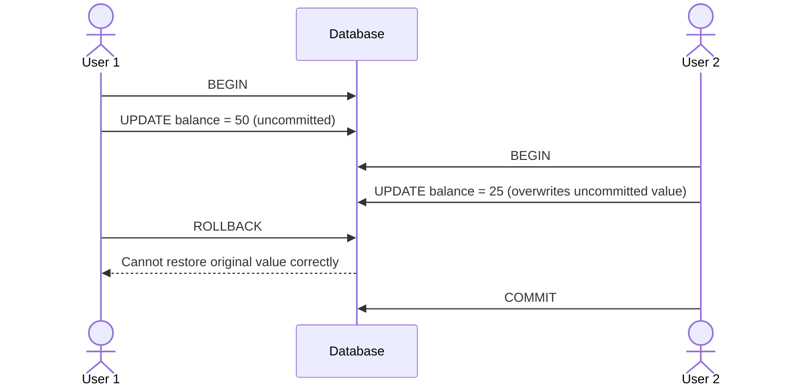

A dirty write occurs when a transaction can overwrite another uncommitted transaction's writes.

Dirty writes can be prevented using row-level locks: only one transaction can hold the row lock at a time; other transactions have to wait for it to commit or abort before the lock is freed.

### Dirty Reads

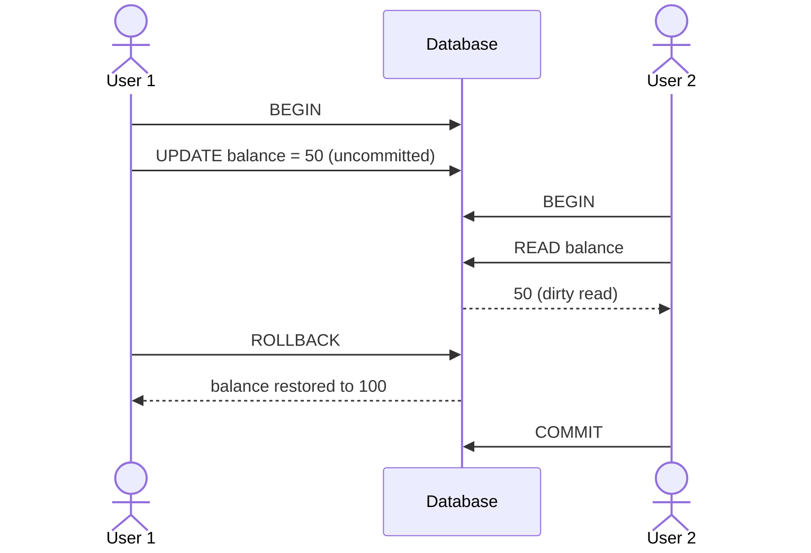

A dirty read occurs when a transaction can read uncommitted writes from another transaction, potentially leading it to make incorrect decisions.

One way to prevent dirty reads is to reuse the row-level locks used in dirty write prevention; this ensures rows being used in a transaction cannot be read. However, this does not scale well, as long-running writes will block any and all reads.

For that reason, most databases do this instead: When a write is made, the database creates a copy of the row for modification, leaving the existing row untouched. Any other concurrent read transactions will use the existing row. Once the write transaction commits, its copy of the row replaces the existing row for all future reads.

> Note that this is not the same as snapshot isolation (next section), as non-repeatable reads and read skew anomalies (both discussed in the next section) can still occur.

## Snapshot Isolation

Snapshot isolation is the next level of transaction isolation that solves three problems:

1. No non-repeatable reads: Reading the same row twice within the same transaction should always return the same data.
2. No read skew: Reading two different but related rows should return data that are compatible with each other.
3. No phantom reads: Executing the same query twice within the same transaction should always return the same set of rows.

In many database implementations, this isolation level is called repeatable read instead.

> The DDIA book groups non-repeatable reads and read skew as the same thing, however they are actually distinct anomalies. [Source](https://stackoverflow.com/questions/73917534/read-skew-vs-non-repeatable-read-transaction).

### Non-Repeatable Read

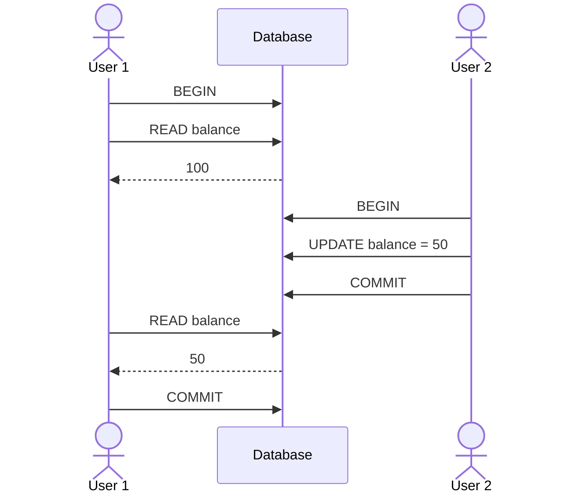

A non-repeatable read is when a transaction reads the same row twice and gets different values because another transaction committed an update in between.

### Read Skew

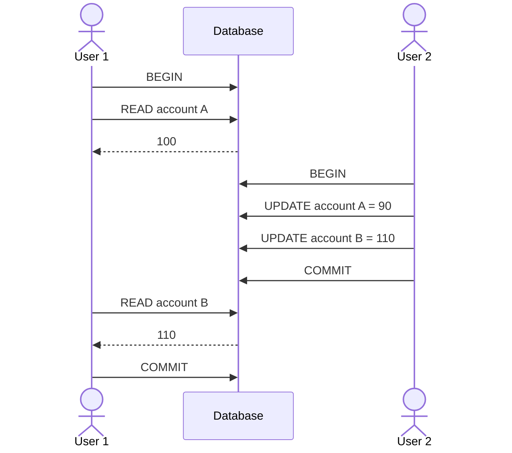

A read skew is when a transaction reads two or more related values and sees an inconsistent combination of old and new data. The individual reads are each committed, but together they do not reflect any single consistent point in time.

In the example above, User 2 makes a transfer from account A to B. Together, the sum of the balances should be 200, but from User 1's point of view, the sum of the balances is 210.

### Phantom Read

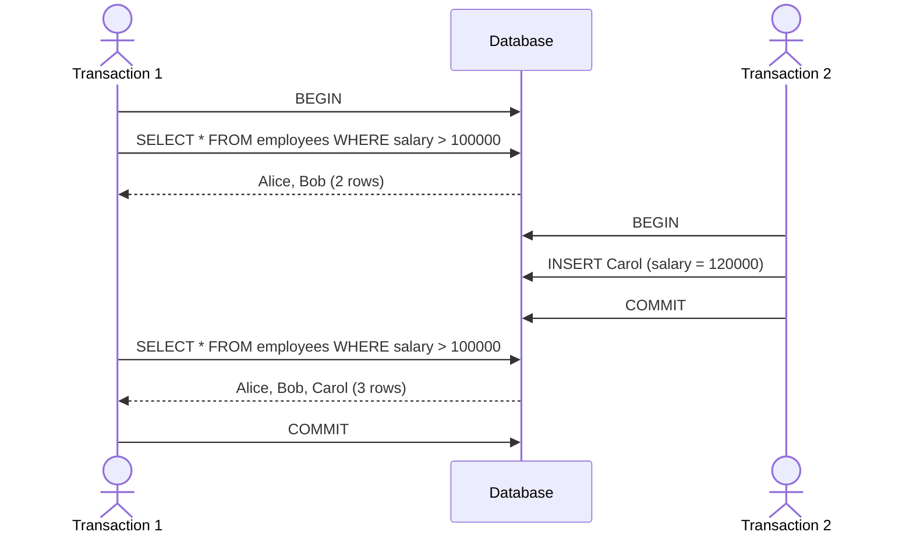

A phantom read occurs when the same query is executed twice within a transaction and returns a different set of rows because another transaction inserted, deleted, or modified rows that match the query.

### Implementation

In the above cases, the anomalies are harmless, but some situations cannot tolerate such temporary inconsistency:

- Making a backup: You could end up with some parts of the database with older data, and other parts with newer data. If you restore from this backup, the inconsistencies become permanent.
- Analytic queries and integrity checks: Long-running queries are likely to return nonsensical data if they observe the database at different points in time.

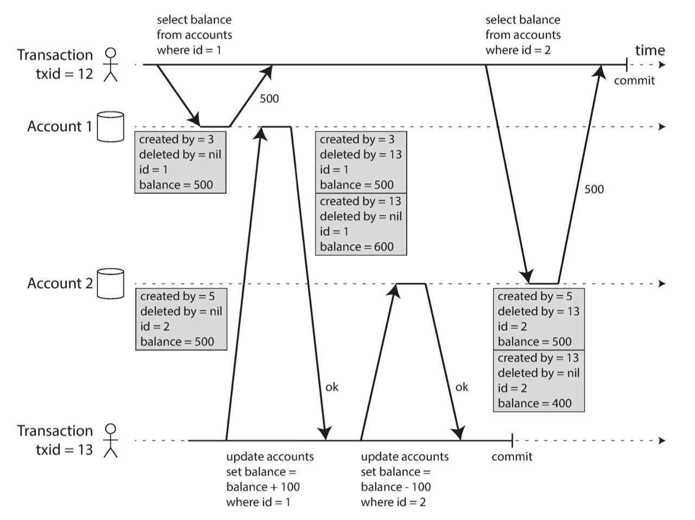

Snapshot isolation fixes this. It is implemented as follows:

- Write locks are used to prevent dirty writes.
- Reading uses a generalization of the technique described in the "Dirty Reads" section. Instead of simply reading the latest committed version of each row, every transaction reads from a consistent snapshot of the database taken when the transaction begins. This is made possible by maintaining multiple versions of each row, a technique known as multi-version concurrency control (MVCC).

MVCC-based snapshot isolation is implemented by using a monotonically increasing transaction ID `tx_id`. Each row in a table has `created_by` and `deleted_by` fields containing the transaction ID that inserted or deleted it. On row modification:

- Row insert: Create a new row with `created_by = tx_id`
- Row delete: Mark row for deletion by setting `deleted_by = tx_id`
- Row update: Mark existing row's `deleted_by = tx_id`; then reinsert a new row with updated data and `created_by = tx_id`

At some later time, when there are no longer any transactions that can access the deleted data, the deleted data will be garbage collected.

The following steps can be used to decide which snapshot to present to the transaction:

1. At the start of the transaction, make a list of other transactions in progress. Ignore writes made by those transactions.
2. Any writes made by aborted transactions are ignored.
3. During the transaction, any writes with higher transaction IDs are ignored.

> In different storage engines, the underlying implementation differs. PostgreSQL stores multiple physical rows that map to the same logical row; readers use filters to query the latest relevant row. Oracle Database does the opposite: the current row is overwritten, but the previous value is stored in an undo log. If an older transaction needs the previous version, the engine reconstructs it from undo information. Other engines organize versions as a linked list; a reader walks the chain until it finds the newest version visible to its snapshot.

## Lost Updates

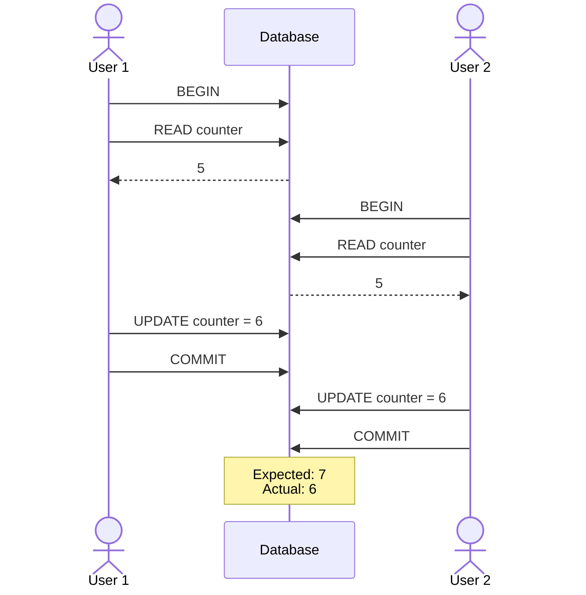

Lost updates are an anomaly that occurs when two transactions overwrite each other's updates. These occur when an application performs a read-modify-write cycle.

### Explicit Locking

```sql
BEGIN;

SELECT value
FROM counters
WHERE key = 'foo'
FOR UPDATE; -- Acquire a row lock on the affected row

-- Application computes: new_value = value + 1

UPDATE counters
SET value = :new_value
WHERE key = 'foo';

COMMIT; -- Releases locks taken within this transaction
```

One way to solve this is by explicitly locking affected rows before performing the read-modify-write cycle and releasing them afterward. Any other transactions are forced to wait until the lock is released.

### Atomic Write Operations

```sql
UPDATE counters SET value = value + 1 WHERE key = 'foo';
```

Many databases provide atomic write operations, which remove the need to implement read-modify-write cycles. These are usually the best solution.

Under the hood, atomic operations are also implemented by taking a lock on affected rows until changes are applied. Conceptually, it is the same as explicit locking above, except the database is managing the lock and release for us.


### Compare-and-Set

For databases that don't support transactions, one sometimes finds an atomic compare-and-set operation:

```sql
UPDATE pages SET content = 'new content'
    WHERE id = 1234 AND CONTENT = 'old content';
```

However, if the database allows the `WHERE` clause to read from an old snapshot (instead of the latest committed one), this will not prevent lost updates. You must check whether the database supports compare-and-set operations.

> Note that lost updates, explicit locking, and compare-and-set methods rely on there being a single up-to-date copy of the data. Thus, they don't work for [[Database Replication|multi-leader or leaderless databases]].

### Detecting Lost Updates

Explicit locking and atomic write operations force the read-modify-write cycles to happen sequentially. An alternative is to execute them in parallel and, if the transaction manager detects a lost update, abort the transaction and force it to retry.

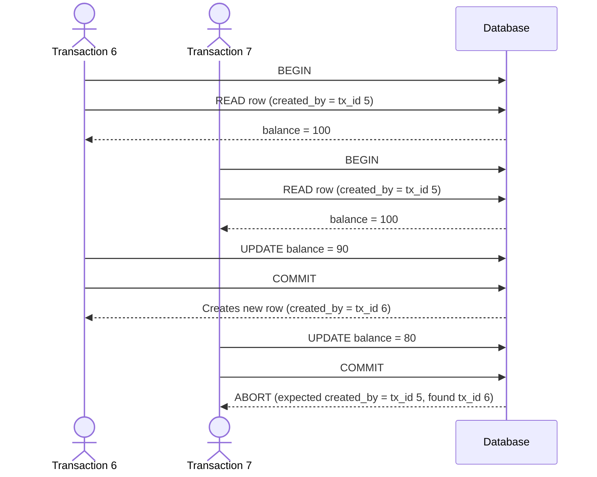

This can be implemented by building upon MVCC systems used in snapshot isolation: Before committing a write, check whether the latest committed transaction ID of the row matches the transaction ID of when the current transaction read it.

## Write Skew

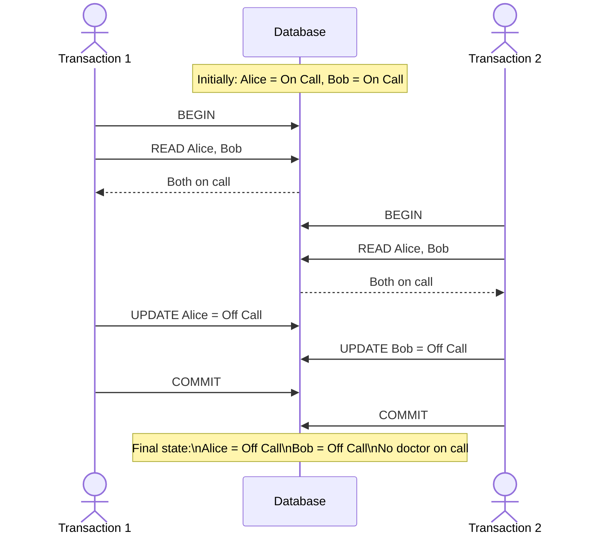

Write skew is an anomaly where two concurrent transactions read the same set of related rows, then each updates a different row based on what they read. Since the transactions modify different rows, they do not conflict directly, but together can violate an application invariant.

In the example above, the application invariant is: "At least one doctor must be on call at any time."

### Explicit Locking

```sql
BEGIN;

SELECT * FROM doctors
    WHERE on_call = true
    AND shift_id = 1234 FOR UPDATE;

UPDATE doctors
    SET on_call = false
    WHERE name = 'Alice'
    AND shift_id = 1234;

COMMIT;
```

As with preventing lost updates, we can also use explicit locks to prevent write skew.

### Materializing Conflicts

Consider another example:

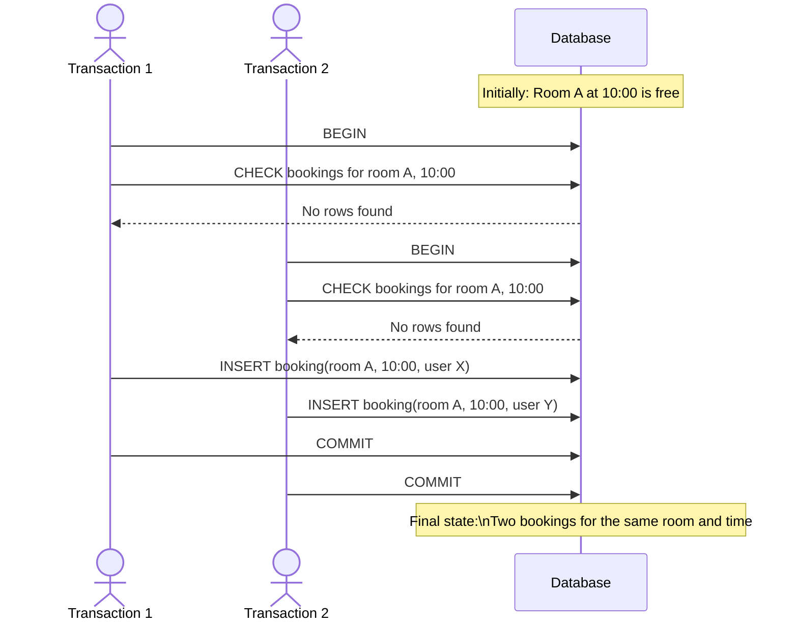

This cannot be solved by explicit locking, because there is nothing to apply the lock to. As such, we need to use a technique called materializing conflicts.

Create a new table of timeslots and rooms; each row in the table corresponds to a particular room for a particular time period of the day (e.g. 15-minute increments). Create rows for all possible combinations of rooms and time periods ahead of time (e.g. 6 months). Now a transaction can lock the rows in the table corresponding to the desired room and time period.

## Serializability

Serializable isolation is the strongest isolation level. It guarantees that even though transactions may execute in parallel, the end result is the same as if they had executed serially. In other words, the database prevents all possible race conditions.

There are three implementations of serializable isolation:

1. Serial execution
2. Two-phase locking
3. Serializable snapshot isolation

### Serial Execution

Serial execution literally removes concurrency and executes transactions one at a time on a single thread.

This only became feasible fairly recently due to two developments:

1. RAM became cheap enough to keep the entire active dataset in memory.
2. Database designers realized OLTP transactions are short enough to run serially; long-running OLAP transactions are typically read-only and can be run on a consistent snapshot outside the serial execution loop.

Systems with single-threaded serial transaction processing don't allow multi-statement transactions. Instead, the application must submit the entire transaction code ahead of time, as a stored procedure.

> The reason stored procedures are required is because multi-statement transactions have to pause the execution thread in between statements, waiting for the application, then resume later. That defeats the purpose of serial execution because the single thread would spend most of its time idle waiting for clients.

To improve database transaction throughput, one technique is to run read-only transactions using snapshot isolation outside the serial execution loop.

Another technique is to scale up to multiple CPU cores by [[partitioning]] the data, where each CPU core can manage its own partition. However, transactions that need to access multiple partitions become complex and require coordination, vastly reducing performance.

### Two-Phase Locking

Two-phase locking (2PL) is similar to how we solve dirty writes, but makes lock requirements much stronger by making writers also block readers.

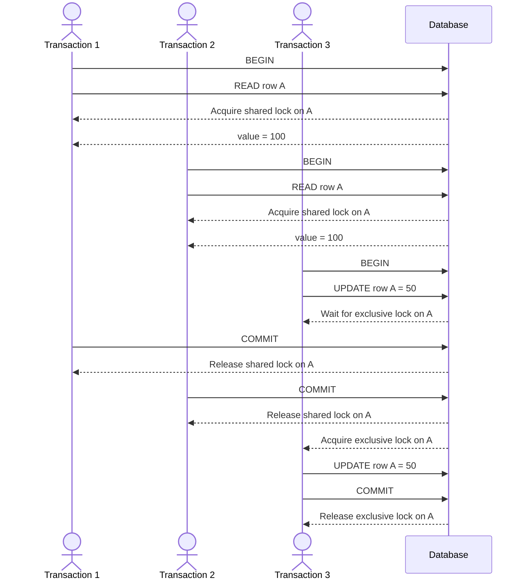

2PL is implemented by having locks on each row in the database; locks can be in either shared mode or exclusive mode:

- If a transaction wants to read a row, it must acquire the lock in shared mode. Several transactions are allowed to hold the lock in shared mode simultaneously, but if another transaction already has an exclusive lock, they must wait.
- If a transaction wants to write a row, it must acquire the lock in exclusive mode. No other transactions may hold any locks (either shared or exclusive) at the same time; if another transaction already has any lock, it must wait.
- If a transaction first reads then writes to a row, it may upgrade its shared lock to an exclusive lock. The same rules apply as when getting an exclusive lock directly.
- Once a transaction has a lock, it must hold the lock until the end of the transaction.

The name "two-phase" comes from:

1. The first phase is when locks are acquired
2. The second phase is when locks are released

Since so many locks are in use, two transactions could be stuck waiting for each other to release the lock. This is called a deadlock. The database should automatically detect deadlocks and abort one of the transactions so it can be retried.

In general, 2PL performs quite poorly due to its implementation and deadlocks.

#### Predicate Locks

2PL itself does not solve write skews; we need predicate locks to solve this. A predicate lock is a lock that belongs to all rows matching some search condition (a predicate). Similar rules to 2PL apply:

- If a transaction wants to read rows matching some condition, it must acquire a shared-mode predicate lock on the conditions in the query. If another transaction currently has an exclusive lock on any row matching those conditions, it must wait.
- If a transaction wants to write rows, it must check whether either the old or new value matches any existing predicate lock. If there is such a predicate lock, then it must wait.

The key idea is that predicate locks apply even to rows that don't yet exist, but which might in the future.

> Note that 2PL without predicate locks does not guarantee serializability.

#### Index-Range Locks

Predicate locks perform poorly. For that reason, most databases implementing 2PL use index-range locking (also known as next-key locking), which approximates predicate locking by locking ranges of index entries instead of arbitrary predicates.

Consider a query:

```sql
SELECT *
FROM bookings
WHERE room_id = 123
  AND slot BETWEEN '10:00' AND '11:00'
  AND building = 'HQ'
FOR UPDATE;
```

If I have only one index:

```sql
CREATE INDEX room_id_index
ON bookings (room_id);
```

Then the database will take an index-range lock on the range corresponding to `room_id = 123`.

If instead I have the index:

```sql
CREATE INDEX room_id_slot_index
ON bookings (room_id, slot);
```

Then the database will take an index-range lock on the range corresponding to `(room_id, slot) = (123, 10:00-11:00)`.

> If several indexes exist, the query planner chooses the index used to execute the query, and the index-range lock is taken on that index.

### Serializable Snapshot Isolation

Serializable Snapshot Isolation (SSI) combines the performance benefits of snapshot isolation with the correctness guarantees of serializable isolation.

Like snapshot isolation, transactions read from a consistent snapshot without blocking writers, and writers do not block readers. Unlike snapshot isolation, the database monitors interactions between concurrent transactions. If it detects a combination of reads and writes that could not have occurred in any serial execution, it aborts one of the transactions and forces it to retry.

For example, consider the write skew anomaly:

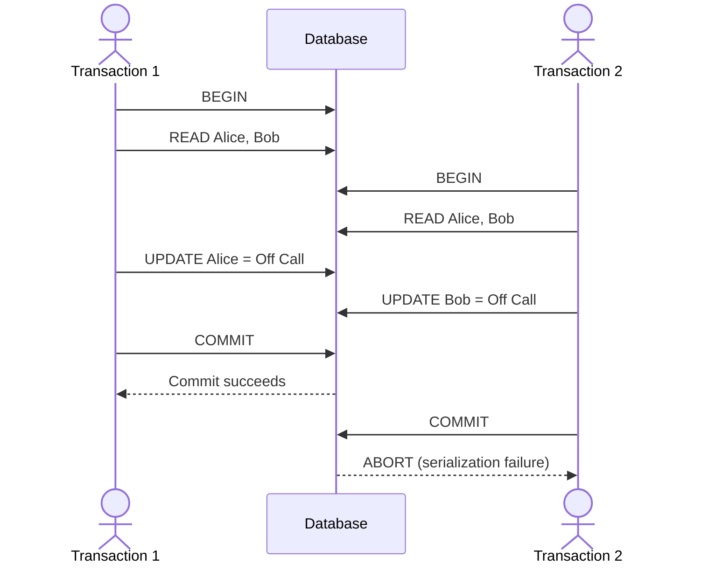

SSI extends snapshot isolation by recording which transactions read which rows (using non-blocking SIREAD locks). When a transaction writes a row, the database records a dependency on any transaction that previously read that row. If these dependencies form a dangerous structure that cannot be serialized, one of the transactions is aborted and retried.

### Pessimistic vs Optimistic Concurrency Control

<!-- TODO: This might be a broader topic than just transactions. Will move out when/if we have a concurrency control TIL in the future -->
Pessimistic concurrency control mechanisms operate on the principle that if anything might go wrong, it's better to wait until the situation is safe again before doing anything. 2PL is such a mechanism.

Optimistic concurrency control mechanisms allow transactions to continue instead of blocking. When a transaction wants to commit, the database checks whether anything bad happened and aborts the transaction so it can be retried when necessary. SSI relies on this.

Optimistic concurrency control performs poorly if there is high contention, as it leads to a high proportion of transactions needing to abort. If the system is already under high load, retrying transactions can make performance worse. However, if there is enough spare bandwidth, optimistic concurrency control mechanisms tend to perform better than pessimistic ones.

## Summary

| Isolation level    | Dirty reads | Dirty writes | Non-repeatable reads | Read skew | Phantom reads | Lost updates* | Write skew |
| ------------------ | :---------: | :----------: | :------------------: | :-------: | :-----------: | :-----------: | :--------: |
| Read Uncommitted   |      ✗      |       ✗      |           ✗          |     ✗     |       ✗       |       ✗       |      ✗     |
| Read Committed     |      ✓      |       ✓      |           ✗          |     ✗     |       ✗       |    Depends    |      ✗     |
| Snapshot Isolation |      ✓      |       ✓      |           ✓          |     ✓     |       ✓       |    Depends    |      ✗     |
| Serializable       |      ✓      |       ✓      |           ✓          |     ✓     |       ✓       |       ✓       |      ✓     |

> \* Depends on the database implementation. Many MVCC databases detect lost updates under Snapshot Isolation, but it is not required by the isolation level. Thus, be sure to add lost update prevention if needed by your application.
