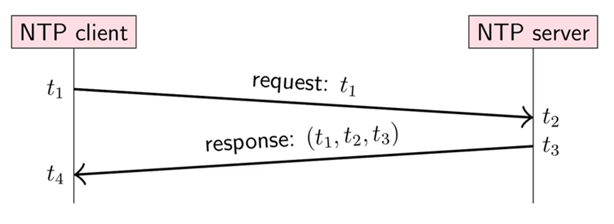
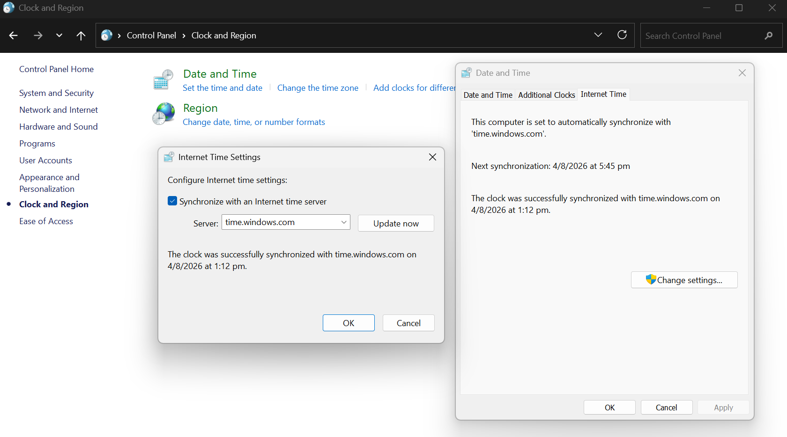
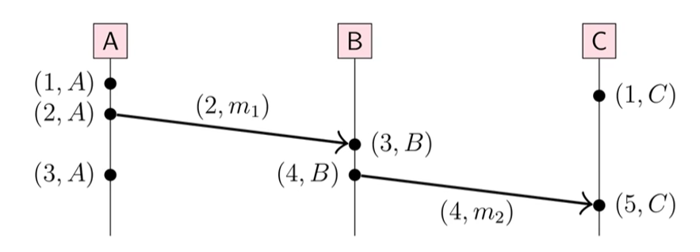
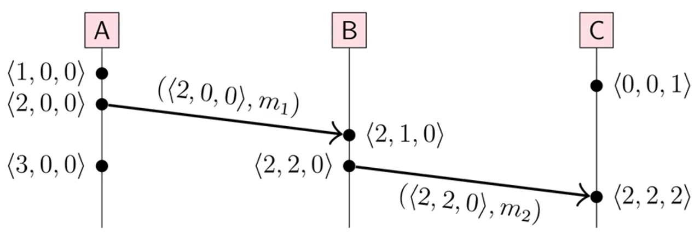

Time is useful in distributed systems for:

- Schedulers, timeouts, failure detection, and retry timers
- Performance measurement, statistics, and profiling
- Log files and databases
- Cache expiry

A clock, in the context of distributed systems, is a source from which a system can obtain a timestamp. The two broad types of clocks are physical clocks and logical clocks.

## Physical Clocks

### Quartz Clocks

Quartz clocks resonate at a specific frequency. By counting their cycles, a computer can measure elapsed time.

However, quartz clocks drift because of temperature changes and manufacturing differences. Drift is measured in parts per million (ppm):

$$
1\ \mathrm{ppm} = 1\ \mathrm{ms/s} = 86\ \mathrm{ms/day} = 32\ \mathrm{s/year}
$$

Most computer clocks are accurate to within about 50 ppm.

### Atomic Clocks

An atomic clock uses the resonance of caesium-133 atoms as its reference. It is more expensive, but incredibly precise.

### GPS Clocks

GPS is another source of accurate time. GPS satellites carry atomic clocks and broadcast their time and position. A receiver can calculate the current time after accounting for signal-propagation delay, atmospheric effects, and relativity.

> GPS is maintained by the U.S. Department of Defense. It was originally built for the Cold War and made available for civilian use in 2000. It is a global resource funded by the U.S., which can deny access in particular zones.

## Time Representations

### Greenwich Mean Time

Greenwich Mean Time (GMT) corresponds to noon when the Sun is due south at the Greenwich meridian. It is based on astronomy and therefore tied to Earth's rotation, which is not constant.

### International Atomic Time

International Atomic Time (TAI, from the French _temps atomique international_) is based on a weighted average of hundreds of atomic clocks worldwide. One TAI second (SI second) is defined as 9,192,631,770 periods of the caesium-133 resonant frequency.

### Coordinated Universal Time

Coordinated Universal Time (UTC) is TAI adjusted to account for Earth's rotation. UTC normally ticks at the same rate as TAI. However, when Earth's rotation drifts far enough from atomic time, a leap second is inserted—or, in theory, removed, although a negative leap second has never occurred.

Leap seconds are planned and announced well in advance:

1. Earth's rotation is continuously monitored to determine UT1, a time scale that reflects the Earth's actual rotation.
2. Scientists compare UT1 with UTC. If the difference approaches $\pm 0.9$ seconds, UTC needs adjustment.
3. The International Earth Rotation and Reference Systems Service (IERS) decides whether to add a leap second and publishes Bulletin C roughly six months in advance.
4. Leap seconds can be inserted at the end of June 30 or December 31. Operating systems, GPS receivers, NTP servers, telecom equipment, and observatories then prepare for the change.

At midnight, three cases are possible:

```text
23:59:58 → 00:00:00  Negative leap second
23:59:59 → 00:00:00  Normal minute
23:59:59 → 23:59:60 → 00:00:00  Positive leap second
```

The number of seconds in a UTC minute is usually 60, but a minute containing a leap second can have 61 seconds—or, theoretically, 59. Therefore, the second and smaller units, such as milliseconds and microseconds, have constant duration, while the minute and larger units have variable duration.

Recent discussions have proposed removing leap seconds because they can disrupt timekeeping systems worldwide. In 2022, the General Conference on Weights and Measures adopted a resolution to change UTC so that leap seconds would be eliminated by or before 2035.

### Computer Time Representations

Computers commonly use two time representations:

1. Unix time: the number of seconds since 1 January 1970 00:00:00 UTC (the _epoch_), with leap seconds ignored. As a result, Unix timestamps cannot represent a leap second and do not map one-to-one to UTC during one.
2. ISO 8601: a date and time written as year, month, day, hour, minute, and second, together with a time-zone offset relative to UTC.

Most software ignores leap seconds. Operating systems and distributed systems, however, still need to account for them. A pragmatic solution is _leap smearing_: spread the extra second over a period such as a day, instead of suddenly stepping the clock by one second.

## Clock Types

Systems expose different clocks for different jobs. A synchronized clock is useful for comparing timestamps across machines, while a monotonic clock is useful for measuring a duration on one machine.

### Time-of-Day Clocks

A time-of-day clock measures time since a fixed date, such as the Unix epoch. Its timestamps can be compared across nodes, provided the clocks are sufficiently synchronized.

Because it is adjusted to track civil time, it can jump forwards or backwards. NTP corrections, manual changes, and leap-second handling may all affect it.

### Monotonic Clocks

A monotonic clock measures time since an arbitrary point, such as machine boot. It only moves forward at a steady rate, making it suitable for durations, timeouts, and retry intervals.

Its values cannot be meaningfully compared across nodes because each machine has its own arbitrary starting point.

### Measuring Elapsed Time

Do not use time-of-day clocks to measure elapsed time:

```python
start_time = time.time()
...  # NTP may step the system clock backwards here
elapsed_seconds = time.time() - start_time  # May be negative
```

Use a monotonic clock for durations and timeouts instead:

```python
start_time = time.monotonic()
...
elapsed_seconds = time.monotonic() - start_time
```

If NTP steps the clock backwards between two time-of-day calls, the calculated duration can be negative. The monotonic clock avoids this because it does not move backwards.

## Clock Synchronization

Computers track time with quartz clocks. Because those clocks drift, their error grows over time. _Clock skew_ is the difference between two clocks at a particular point in time.

To reduce clock skew, computers periodically obtain the current time from a server with a more accurate source, such as an atomic clock or GPS receiver. Two common protocols are the Network Time Protocol (NTP) and Precision Time Protocol (PTP).

### Network Time Protocol

The Network Time Protocol (NTP) synchronizes clocks between computer systems over packet-switched, variable-latency networks.

NTP is intended to synchronize participating computers to within a few milliseconds of UTC. It can usually maintain time within tens of milliseconds over the public internet, and can achieve better than one millisecond accuracy on local-area networks under ideal conditions.

#### Clock Hierarchy

NTP uses a hierarchy of clock servers arranged into strata:

1. Stratum 0: An atomic clock or GPS receiver. These devices are also known as _reference clocks_.
2. Stratum 1: A server synchronized directly with a stratum 0 device. These are _primary time servers_.
3. Stratum 2: A server synchronized with a stratum 1 server.
4. Stratum $n$: A server synchronized with a stratum $n - 1$ server.

The upper limit is stratum 15. Stratum 16 indicates that a device is unsynchronized. Clients never synchronize directly with stratum 0 because it is a component attached to a stratum 1 server.

#### Estimating Network Delay and Clock Offset

Start with one request-response exchange. The client records when it sends the request ($t_1$) and receives the response ($t_4$). The server records when it receives the request ($t_2$) and sends the response ($t_3$).



Given the timestamps, the round-trip network delay is:

$$
\delta = (t_4 - t_1) - (t_3 - t_2)
$$

The estimated server time when the client receives the response is:

$$
t_3 + \frac{\delta}{2}
$$

The estimated clock offset is:

$$
\theta = t_3 + \frac{\delta}{2} - t_4 = \frac{(t_2 - t_1) + (t_3 - t_4)}{2}
$$

This assumes that the request and response each take half of the round-trip delay. Because the clocks are not yet synchronized, NTP cannot know the exact request and response delays separately.

#### Selecting and Correcting

The calculation above produces one offset and delay sample for one server exchange. The client repeats it over time and with multiple candidate servers.

For each server, NTP filters the samples to reduce the effect of variable network latency. It then compares the candidate servers, rejects outliers, and derives a trusted system offset from the remaining consistent sources. This reduces random error and protects the client from a bad server.

> NTP does not necessarily take a simple arithmetic average of every server offset. Its filtering and source-selection algorithms give more weight to reliable, mutually consistent sources.

Once a client has an offset estimate, it disciplines its local clock. The exact policy is implementation- and configuration-dependent. Traditional `ntpd` defaults use a 128 ms step threshold and a 1,000 s panic threshold:

- Below 128 ms, _slew_ the clock by gradually changing its oscillation rate by up to 500ppm until the offset disappears.
- At or above 128 ms, _step_ the clock by immediately setting it to the estimated time.
- At or above the 1,000 s panic threshold, `ntpd` normally exits and requires operator intervention.

NTP then repeats the process. The polling interval is adaptive: stable clocks are polled less frequently, while unstable clocks are polled more frequently. A traditional `ntpd` maximum poll interval is 1,024 seconds, or about 17.1 minutes, but it can be configured differently.



Almost all operating systems support NTP through a setting such as “Set time automatically,” which lets the user choose an NTP server.

### Precision Time Protocol

The Precision Time Protocol (PTP) is designed for much more accurate clock synchronization within a local network, often reaching sub-microsecond accuracy.

Like NTP, PTP exchanges timestamped messages to estimate delay and clock offset. Unlike NTP, it assumes a more controlled network and uses a _grandmaster_ clock selected from participating devices. Network hardware, such as switches and network interface cards, can timestamp packets close to the wire and compensate for the time spent traversing the network.

PTP is commonly used where precise coordination matters, such as financial trading, industrial automation, telecommunications, and media production. NTP is the more practical general-purpose choice for synchronizing clocks across the public internet.

## Causality and Happens-Before

Physical clocks cannot reliably establish causality. Two machines may have clock skew, and even perfectly synchronized physical clocks cannot tell whether one event caused another.

The _happens-before_ relation, written $a \to b$, is defined by three rules:

1. If two events occur in the same process, their program order determines the relation.
2. Sending a message happens before receiving that message.
3. The relation is transitive: if $a \to b$ and $b \to c$, then $a \to c$.

Two events are [[Concurrency|concurrent]] when neither $a \to b$ nor $b \to a$. They may occur at different physical times; in this context, “concurrent” means that neither event could have influenced the other.

> A good explanation of happens-before and ideal ordering can be seen [here](https://youtu.be/YqNGbvFHoKM?si=Mnj7jxYcOhbfnItL&t=116).

## Logical Clocks

A logical clock does not measure wall-clock time or elapsed duration. Instead, it assigns timestamps to events so that a system can reason about the causal order.

### Lamport Clocks

A Lamport clock is a single integer counter $t$ maintained by each process. Before every local event, the process increments $t$. Let $L(e)$ be the value of $t$ immediately after it is incremented for event $e$; this is the Lamport timestamp attached to $e$.



Each process follows these rules:

1. Before a local event or sending a message, set $t \leftarrow t + 1$ and attach $t$ to the event or message.
2. When receiving a message with timestamp $t_m$, set $t \leftarrow \max(t, t_m) + 1$.

Lamport clocks guarantee:

$$
a \to b \implies L(a) < L(b)
$$

The converse is not true. If $L(a) < L(b)$, $a$ and $b$ may still be concurrent; the clock gives a possible ordering, not proof of causality.

The Lamport timestamp alone does not uniquely identify an event: two different nodes can produce the same timestamp. Let $N(e)$ be the unique ID of the node where event $e$ occurred. Because each node increments its counter before every event, that node cannot produce two events with the same $L(e)$. Therefore, the pair $(L(e), N(e))$ uniquely identifies an event.

To produce a deterministic total order, a system can sort events by $(L(e), N(e))$. This breaks ties between concurrent events, but the resulting order is arbitrary and should not be mistaken for a causal relationship.

> At first glance, Lamport clocks seem to provide weak guarantees. However, the main application of Lamport clocks is to produce a total order that all nodes in a distributed system can rely on, not actually to detect causality. They are useful in cases where all we need are a consistent order, such as ordering operations in a replicated log.

### Vector Clocks

Where a Lamport clock uses one scalar, a vector clock keeps one counter per node. Assume a system of $n$ nodes:

$$
N = \langle N_1, N_2, \ldots, N_n \rangle
$$

Each node maintains its current vector timestamp:

$$
T = \langle t_1, t_2, \ldots, t_n \rangle
$$

The component $t_i$ records how many events from node $N_i$ the current node has observed. The vector timestamp $V(e)$ of an event $e$ is the value of $T$ immediately after processing $e$.



Each node follows these rules:

1. For a local event or before sending a message, node $N_i$ increments its own entry: $T[i] \leftarrow T[i] + 1$. The resulting vector is $V(e)$; a sent message carries that vector.
2. When node $N_i$ receives a message carrying vector $V_m$, it first merges the message into its local knowledge component by component: $T[j] \leftarrow \max(T[j], V_m[j])$ for every $j$. It then increments its own entry, $T[i] \leftarrow T[i] + 1$, and uses the result as the receive event's $V(e)$.

The vector $V(e)$ represents event $e$ together with its causal history: every event that $e$ has observed, directly or transitively.

Define the following partial order on vector timestamps $T$ and $T'$:

- $T = T'$ if $T[i] = T'[i]$ for every node $i$.
- $T \leq T'$ if $T[i] \leq T'[i]$ for every node $i$.
- $T < T'$ if $T \leq T'$ and $T \neq T'$.
- $T \parallel T'$ if neither $T < T'$ nor $T' < T$; the vectors are incomparable.

Applied to event timestamps:

- $V(a) < V(b)$ if and only if $a \to b$.
- If $V(a) \parallel V(b)$, then $a$ and $b$ are concurrent.

A vector timestamp alone does not necessarily uniquely identify an event: different nodes can produce the same vector after observing the same causal history. As with Lamport clocks, the pair $(V(e), N(e))$ uniquely identifies an event, because the originating node increments its own component before every event.

Unlike Lamport clocks, vector clocks can distinguish a causal relationship from concurrency.

## Hybrid Logical Clocks

A hybrid logical clock (HLC) combines a physical clock with a small logical counter. The physical part keeps the timestamp close to wall time, while the logical part preserves causal ordering when physical time does not move forward cleanly. In practice, HLC gives a compact timestamp that usually resembles real time while still carrying ordering information for distributed systems.


An HLC timestamp is usually written as a pair:

$$
HLC = (p, c)
$$

Here, $p$ is the physical-time component and $c$ is the logical counter.

Initially, the clock starts at:

$$
HLC = (0, 0)
$$

For a local event:

1. On any local event, read the current physical clock time $T$.
2. If $T > p$, set $p \leftarrow T$ and reset $c \leftarrow 0$.
3. Otherwise, keep $p$ unchanged and set $c \leftarrow c + 1$.
4. The HLC timestamp for the event is $(p, c)$.

On receiving a message with timestamp $(p_m, c_m)$:

1. Save the old local state as $(p_{old}, c_{old})$ and read the current physical clock time $T$.
2. Set $p \leftarrow \max(p_{old}, p_m, T)$.
3. If $p = p_{old} = p_m$, set $c \leftarrow \max(c_{old}, c_m) + 1$. (This is relatively rare, thus not shown in the diagram above.)
4. Otherwise, if $p = p_{old}$, set $c \leftarrow c_{old} + 1$.
5. Otherwise, if $p = p_m$, set $c \leftarrow c_m + 1$.
6. Otherwise, $p = T$ is strictly greater than both stored physical components, so set $c \leftarrow 0$.
7. The updated pair $(p, c)$ is the receive event’s timestamp.

> A video explanation of HLB [here](https://youtu.be/YqNGbvFHoKM?si=-nR93Rd-v5ZXz5Pk&t=263).

Drawbacks of HLC:

- Like Lamport clocks, HLC timestamps preserve causal order but cannot distinguish causality from concurrency. To make equal HLC timestamps into a total order, add a node ID as a tie-breaker.
- It still depends on reasonably synchronized physical clocks. If one machine's clock is far ahead because of clock skew, its HLC timestamps will also be far ahead. [See this](https://youtu.be/YqNGbvFHoKM?si=_ahct3mqtudzflrw&t=587).
- HLC timestamps look like real timestamps, but are only as accurate as the underlying clock synchronization.
