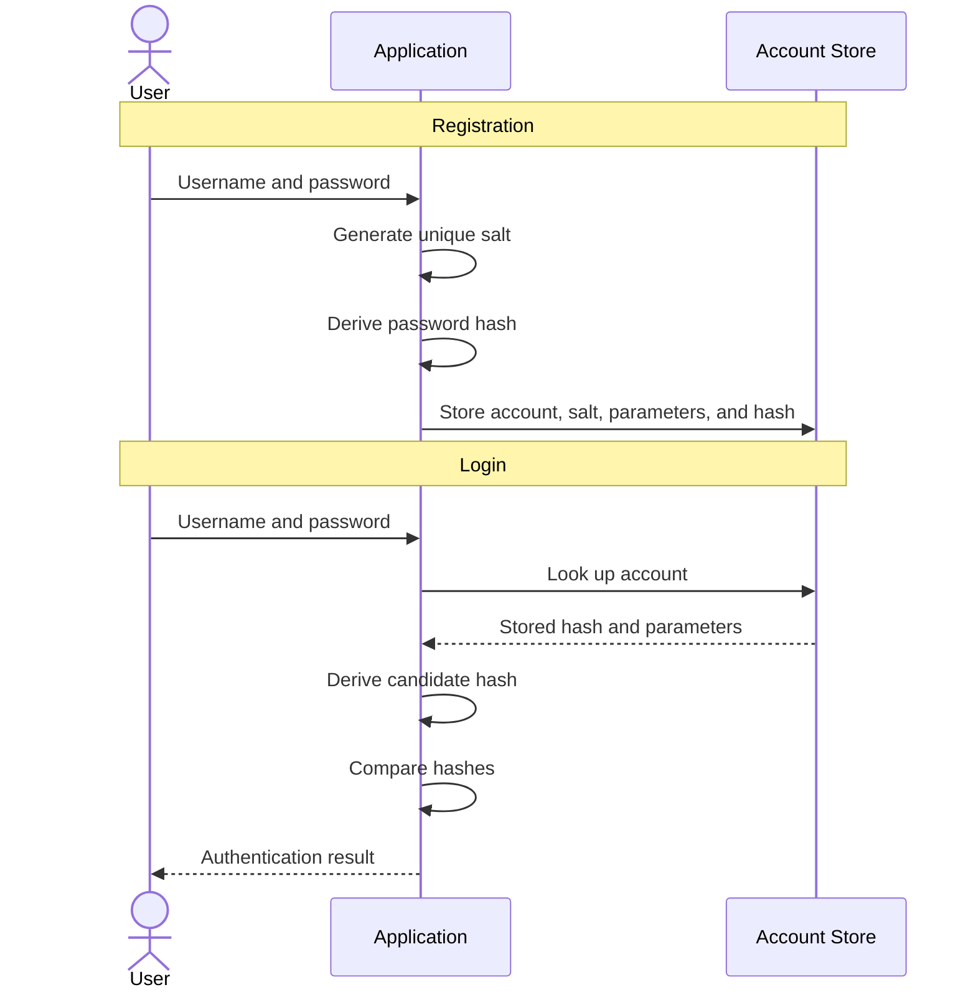
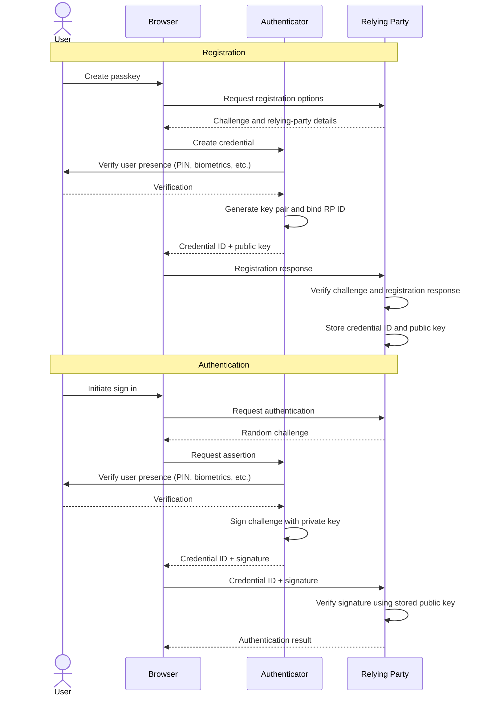
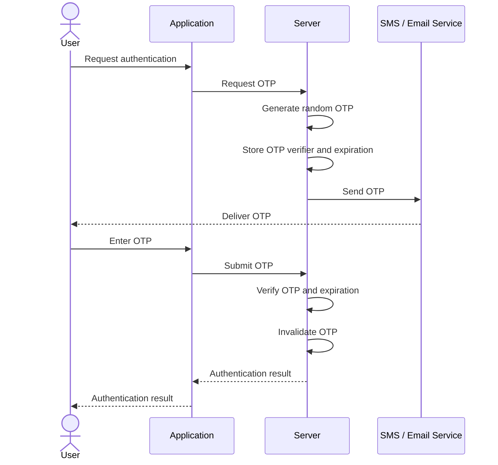
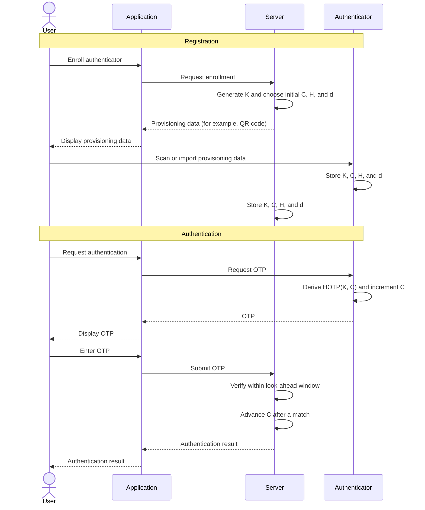

## Authentication

An *identity* is the representation of an entity within a particular system. It might represent a human user, a workload, a service account, a device, or an organization. An identity typically consists of one or more identifiers and associated attributes.

A *subject* is an entity that requests access to an object or resource. Depending on the context, a subject may refer to the entity itself or the active representation of that entity, such as a running process acting on a user's behalf.

A *principal* is the identity that a system associates with a subject when making authentication and authorization decisions. After a subject is authenticated, the principal represents who is making the request and is used to evaluate permissions.

> The terms subject and principal are overloaded and are often used interchangeably.

*Claims* are statements about a principal, such as its identifier, organization, email-verification status, roles, or authentication method. Claims are commonly used during authorization, but they are not automatically trustworthy merely because the client supplied them. The server must obtain them from a verified session, a valid token, or its own data store.

*Authentication* is the process of verifying the identity of a user, process, or device. More simply, it's the process of verifying that "you are who you say you are."

> Authentication is typically a prerequisite for authorization.

### Authentication Factors

The ways in which someone may be authenticated fall into five categories, known as *authentication factors*:

1. Knowledge: Something the user knows, such as a password, passphrase, personal identification number (PIN), or security question.
2. Possession: Something the user has or owns, such as a wrist band, ID card, security token, software token, or digital certificate.
3. Inherence: Something the user is, such as a fingerprint, retinal pattern, DNA sequence, face, or voice.
4. Location: Somewhere the user is, such as a GPS location, corporate network, or geofence.
5. Behavior: Something the user does, such as typing rhythm or mouse movement.

*Single-factor authentication* (SFA) is the weakest level of authentication: only one component is used to authenticate an identity.

*Multi-factor authentication* (MFA) involves two or more authentication factors. *Two-factor authentication* (2FA) is a special case of MFA involving exactly two factors.

> Traditionally, there were only three primary authentication factors: knowledge, possession, and inherence. Location and behavior are considered secondary factors.

## Password Authentication

*Password authentication* verifies that a user knows the password associated with an account. The server never needs to recover that password; it stores a password verifier and checks a new password attempt against it.

The following sequence diagram shows registration followed by a later successful password login:

<!-- TODO: Add caption -->


A password *verifier* refers to the derived hash plus associated parameters like salt, algorithm, and cost parameters.

### Hashing

Passwords must be stored with a one-way verifier, not with reversible encryption. Encryption is normally inappropriate because decrypting an encrypted password recovers the original secret.

However, general purpose cryptographic hash functions still suffer from a few problems:

- Password choices are highly skewed, 5,000 most common passwords cover about 20% of users.
- Passwords are reused across services.

An attacker who obtains a password database can test breached username-and-password pairs, common passwords, or brute-force candidates without being limited by the application's login rate limits. This is called *offline cracking*.

*Key stretching* is one solution. It increases the time required to test each candidate password, traditionally by repeatedly applying a cryptographic hash or block-cipher-based derivation.

However, key stretching with a fast general-purpose [[Hashing|hash]] is still not ideal. A function such as SHA-256 mainly consumes CPU, allowing an attacker to exploit the massive parallelism of GPUs or ASICs.

### Password Hashing Functions

A *password hashing function* is deliberately expensive to compute and tune. It should also provide *memory hardness*, requiring substantial memory for every guess. Memory hardness can stop massively parallel password cracking via GPUs, as GPU VRAM is much more limited.

> Some such algorithms include Argon2id, scrypt, bcrypt, PBFDF2 etc.

*Cost parameters* control the resources required for one password verification. Depending on the algorithm, they may include an iteration count, memory cost, parallelism, or bcrypt work factor.

As hardware improves, applications should raise their parameters and rehash a user's password with the new parameters after a successful login.

> Password hashing functions are not the same as cryptographic hashing functions. The former is designed to be expensive to compute and tunable, while the latter is designed to be fast and general purpose.

### Salts

Without salts, an attacker can precompute a mapping from common passwords to their hashes and reuse it against every database row. This is a *rainbow table* attack: the attacker pays the cost of hashing a candidate password once, then performs a lookup to identify every account with the corresponding stored hash.

A *salt* is unique random data supplied to the password hashing function for each stored password. The salt is stored with the verifier and doesn't need to be secret; its purpose is to ensure that identical passwords produce different stored hashes.

With a unique salt, the attacker must derive a candidate hash separately for each account. This makes rainbow-table precomputation impractical and prevents the attacker from sharing cracking work across users with the same password.

It is recommended to generate a new salt whenever a password is created or changed, such that if the user uses the same password, the stored hash is still different.

> The simplest salt function is simply `hash(password, salt) = hash(password + salt)`. That is, just by concatenating the salt with the password before feeding into the hash function. Real password-hashing functions combine the password and salt according to their algorithm instead.

### Peppers

A *pepper* is an optional secret added to password verification in addition to a salt. Unlike a salt, a pepper is shared across many verifiers and stored separately from the password database, for example in a secret manager or hardware security module.

If an attacker steals the database but not the pepper, cracking the verifiers becomes significantly harder. Rotating a compromised pepper generally requires users to provide their passwords again, often through a forced password reset.

### Timing and Account-Enumeration Attacks

An *account-enumeration attack* can use login response times to determine whether a username exists. For example, this implementation returns immediately for an unknown account but performs an expensive password derivation for a known account:

```python
account = find_account(username)
if account is None:
    return "Invalid login"

candidate_verifier = password_hash(password, account.verifier.parameters)
return "Authenticated" if hmac.compare_digest(candidate_verifier, account.verifier.hash) else "Invalid login"
```

An attacker can distinguish the fast unknown-account path from the slower known-account path by measuring response times.

A *timing attack* can also target the verifier comparison itself. A naive comparison returns at the first mismatched byte, so its running time can reveal how long two inputs share a prefix. An attacker that measures this signal carefully may infer the verifier one byte at a time.

A *constant-time comparison* processes the full inputs before returning, reducing this timing signal. Many libraries provide constant-time comparison functions to reduce timing attack risks.

### Credential Stuffing

*Credential stuffing* is an automated attack that tries username-and-password pairs leaked from one service against other services.

> Salts don't prevent credential stuffing: the attacker already knows candidate passwords in plaintext

## Public Key Authentication

*Public-key authentication* lets a subject prove possession of a private cryptographic key without sending that key to the server. The subject creates a *key pair*: it keeps the private key secret and registers the corresponding public key with the server.

Unlike password authentication, the server doesn't store a shared secret or a password verifier. It verifies a *digital signature* using the registered public key instead.

Public-key authentication usually uses *challenge-response*:

1. The server creates a fresh random challenge and sends it to the client.
2. The client signs the challenge with its private key and returns the signature.
3. The server verifies the signature with the subject's registered public key.

Generic public-key authentication doesn't prescribe where the private key is stored; it may be a file, a hardware security key, a device secure enclave, or another protected key store.

### Replay Attacks

A *replay attack* occurs when an attacker records valid authentication data and sends it again later. For example, if Alice sends a hashed password to Bob and Eve records it, Eve may be able to resend the same value to impersonate Alice:


Challenge-response prevents this by requiring a fresh unpredictable challenge for each authentication attempt. A signature from a previous challenge won't verify for the next one. The server must also reject a challenge after it has been used and expire unused challenges promptly.

### Passkey Authentication

*Passkey authentication* is public-key authentication for web applications, typically implemented with WebAuthn. The web application is the *relying party*; the browser mediates between it and an *authenticator*, such as Windows Hello, Face ID, Touch ID, or a hardware security key.

During registration, the authenticator generates a key pair. It keeps the private key, while the relying party receives the public key and a credential identifier (like a user ID).

When creating the credential, the authenticator scopes it to the relying party's *RP ID*, which is its domain name. The browser permits a site to request that credential only when its origin belongs to that RP ID. A phishing site such as `evil-example.com` therefore can't request or use a credential registered for `example.com`.

During authentication, the relying party sends a fresh challenge. After the user verifies their presence or identity, for example with a fingerprint, face scan, or device PIN, the authenticator signs that challenge and returns the credential identifier and signature, which the browser forwards to the relying party.

The following sequence diagram shows a typical passkey authentication flow:

<!-- TODO: Add caption -->


The registration challenge binds the registration response to a specific, fresh registration request, preventing an old registration response from being accepted as a new registration.

Passkeys provide several security advantages over passwords:

- The private key doesn't leave the authenticator.
- The relying party stores only a public key, eliminating password-verifier disclosure.
- Authentication uses a fresh random challenge, preventing replay attacks.
- Credentials are scoped to the relying party's domain, making passkeys resistant to phishing attacks.

## One-Time Password Authentication

*One-time password authentication* uses a short code that is valid for one authentication attempt or transaction. An intercepted OTP can't normally be replayed after it has been accepted, unlike a static password.

Two common designs are random OTPs issued by the server and deterministic OTPs generated by an authenticator that shares a secret with the server.

### Random OTPs

A random OTP is a randomly generated code that is valid for a single authentication attempt or other operation. The server generates the code and delivers it to the user, commonly through SMS or email.

The server associates the OTP with the authentication attempt and an expiration time. When the user submits the code, the server verifies that it matches, has not expired, and has not already been consumed. After successful verification, the OTP is invalidated.

The following sequence diagram shows authentication using a random OTP:

<!-- TODO: Add caption -->


Random OTPs should be generated using a cryptographically secure random number generator, expire after a short period, and be invalidated after successful use.

### HOTP

*HMAC-based one-time password* (HOTP) is a counter-based OTP algorithm defined in [RFC 4226](https://www.rfc-editor.org/rfc/rfc4226.html). The authenticator and server share a secret, then independently derive the same short code from that secret and a counter.

At enrollment, the authenticator and server must receive and store the same parameters. They must agree on and store the follwing values:

- A shared secret $K$, unique to the authenticator and kept private.
- An initial eight-byte counter $C$, called the *moving factor*.
- An HMAC algorithm $H$ (RFC 4226 specifies HMAC-SHA-1).
- A code length $d$, usually six to eight decimal digits.

The code is derived by HMACing the counter with the secret, dynamically truncating the result to a 31-bit integer, and reducing it modulo $10^d$:

$$
\operatorname{HOTP}(K,C) = \operatorname{Truncate}(\operatorname{HMAC}_{H}(K,C)) \bmod 10^D
$$

The authenticator displays or submits this code. The server computes its expected code, verifies the submitted value, and advances its counter only after a successful verification.

The following sequence diagram shows how the shared parameters are provisioned before HOTP authentication:



#### Counter Synchronization

The authenticator advances $C$ whenever it generates a code, even if the user never submits it. The server advances only after accepting a code. Therefore, the ordinary failure mode is that the authenticator gets ahead of the server.

For example, a user might press a hardware token's button three times without logging in:

$$
C_{\text{server}} = 10, \qquad C_{\text{authenticator}} = 13
$$

The server can search forward within a small *look-ahead window* $s$, deriving codes for counters $C$ through $C+s$. When it finds a match, it advances its stored counter to the position after that match. This resynchronizes the pair without action from the authenticator.

The server must not search backward. A counter below its current accepted value corresponds to an old, consumed OTP. Accepting it would make a recorded OTP valid again and defeat replay protection.

For the same reason, ordinary look-ahead can't repair the unusual case where the authenticator falls behind the server. A separate resynchronization or re-provisioning procedure is needed.

#### Provisioning and Storage

HOTP doesn't specify how to provision the shared secret. An implementation must use a secure enrollment channel. Authenticator apps commonly use `otpauth://hotp/` URIs containing a label, secret, initial counter, and other required metadata; which can be displayed and read as a QR-code.

The shared secret is sensitive on both sides. Unlike password authentication, the server can't store only a one-way verifier: anyone who obtains the HOTP secret can generate future valid codes. The setup channel must therefore protect the seed, and the server must protect its stored copy.

### TOTP

*Time-based one-time password* (TOTP) is the time-based variant of HOTP, defined in [RFC 6238](https://www.rfc-editor.org/rfc/rfc6238.html). Instead of advancing a counter whenever an authenticator generates a code, TOTP derives the HOTP counter from the current time. This avoids maintaining a synchronized counter, but requires the authenticator and server clocks to remain close enough.

At enrollment, the authenticator and server must share the HOTP secret $K$, HMAC algorithm $H$, code length $d$, and these time parameters:

- The initial time $T_0$, usually the Unix epoch (0).
- The time-step length $X$, commonly $30$ seconds.

At time $T$, both sides derive a time-step counter $C_T$ and use it as HOTP's moving factor:

$$
C_T = \left\lfloor \frac{T-T_0}{X} \right\rfloor
$$

$$
\operatorname{TOTP}(K,T) = \operatorname{HOTP}(K,C_T)
$$

The authenticator generates and displays the TOTP. The user enters it into the application, which submits it to the server. The server derives the expected OTP for its current time step and compares it with the submitted value.

#### Clock Drift and Verification Windows

An authenticator and server won't always agree on the exact time. Network delay, user delay, and [[Time|clock drift]] can put the generated code in an adjacent time step. The server can check a small window of nearby time steps, for example the current step and one previous step.

Larger windows improve usability but increase the number of valid codes and extend the time in which a stolen code can be used. The window should therefore be as small as practical.

#### Replay Within a Time Step

TOTP codes are not inherently single-use. The same code remains mathematically valid for its entire time step, so an attacker who captures it can replay it before that step ends if the server checks only whether it matches the current time step.

To enforce strict one-time use, the server must record the time step of a successful verification for each authenticator and reject another code for that same or an older accepted step. This adds state that HOTP already maintains through its advancing counter.

> RFC 6238 requires a verifier not to accept a second successful use of an OTP within the same time step.

## API Key Authentication

An *application programming interface (API) key* is an opaque credential that identifies a calling application, developer, or workload to an API. The API maps the key to an account, project, or service identity, then applies that identity's permissions, quotas, and rate limits.

### Generation and Storage

An API key must be generated with a cryptographically secure pseudorandom number generator (CSPRNG) and contain enough random entropy to resist guessing. Unlike passwords, API keys aren't user chosen and should have high entropy. A normal cryptographic hash such as SHA-256 is therefore sufficient for a stored verification value. Brute-forcing a randomly generated 128-bit or 256-bit API key after a database leak is infeasible.

API keys commonly combine a public key identifier with a secret, for example `sk_<key_id>_<secret>`. The server stores the identifier in plaintext and hashes only the secret. It can then find the key record directly and verify the submitted secret without scanning every stored key.

Alternatively, the entire key can be secret, for example `sk_<secret>`, and the server can use its hash as the lookup value.

### Lifecycle and Limits

An API key should have an owner, purpose, scopes or permissions, creation time, optional expiration time, and audit history. Support key rotation and immediate revocation so a leaked or no-longer-needed key can be replaced without waiting for a password reset or session expiry.

Send API keys only over HTTPS, typically in an HTTP request header. Query parameters are a poor transport because they are commonly recorded in logs, browser history, monitoring tools, and referrer headers.

## Certificate-Based Authentication

This is a subset of public key auth actually. But large so make its own section

<!-- TODO: To learn after "Certificates and PKI" TIl -->

### Mutual TLS (mTLS) Authentication

## Federated Authentication
