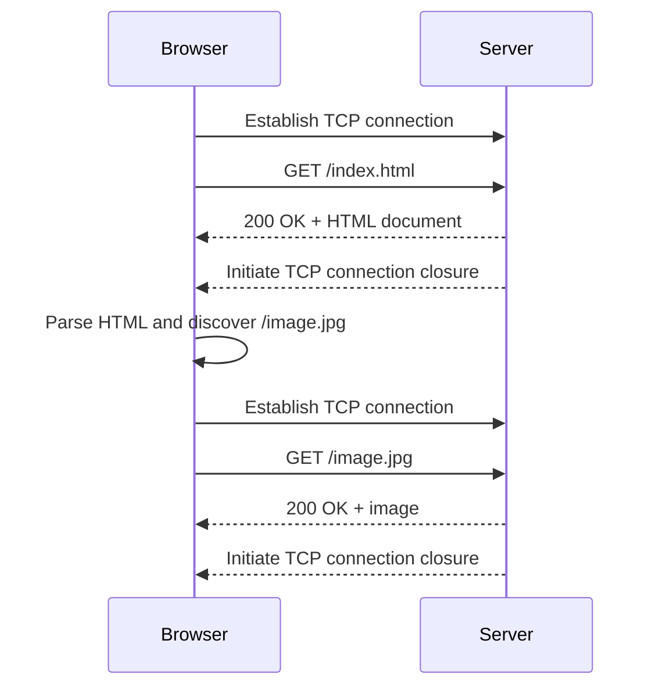
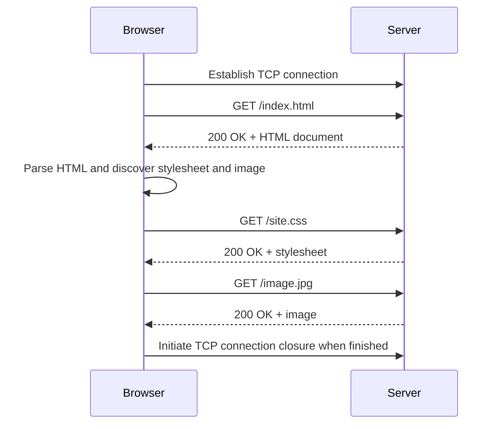
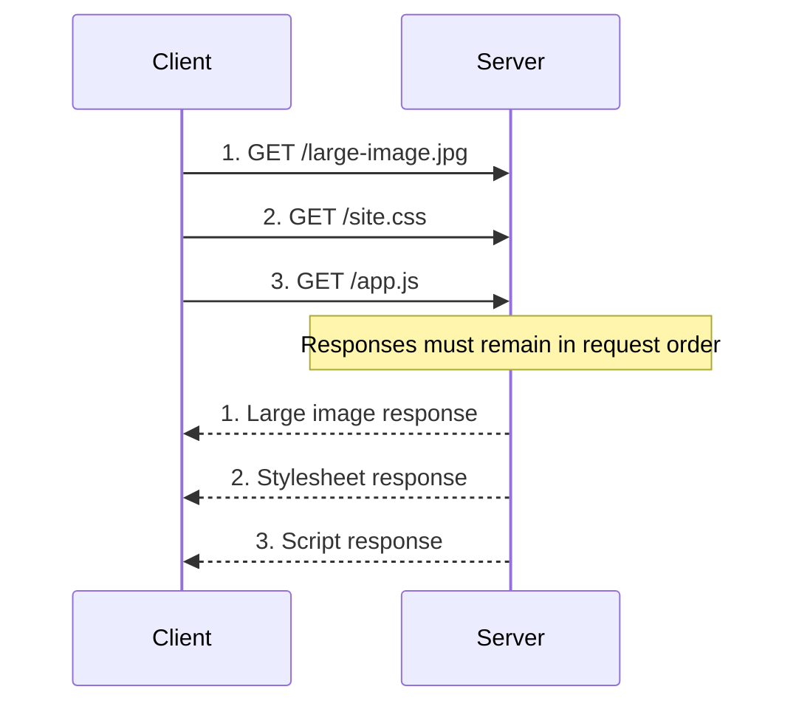
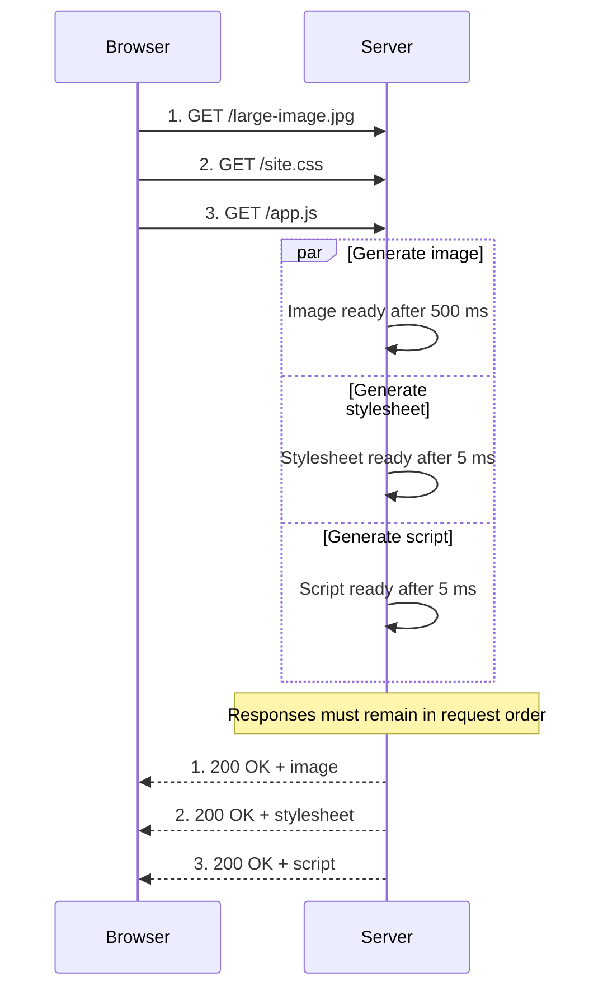
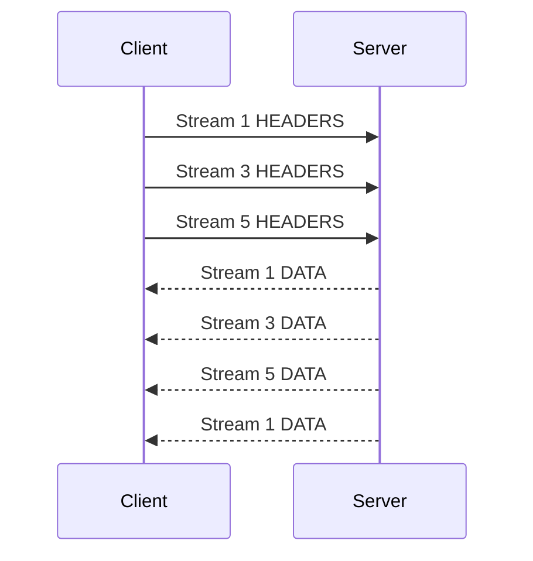
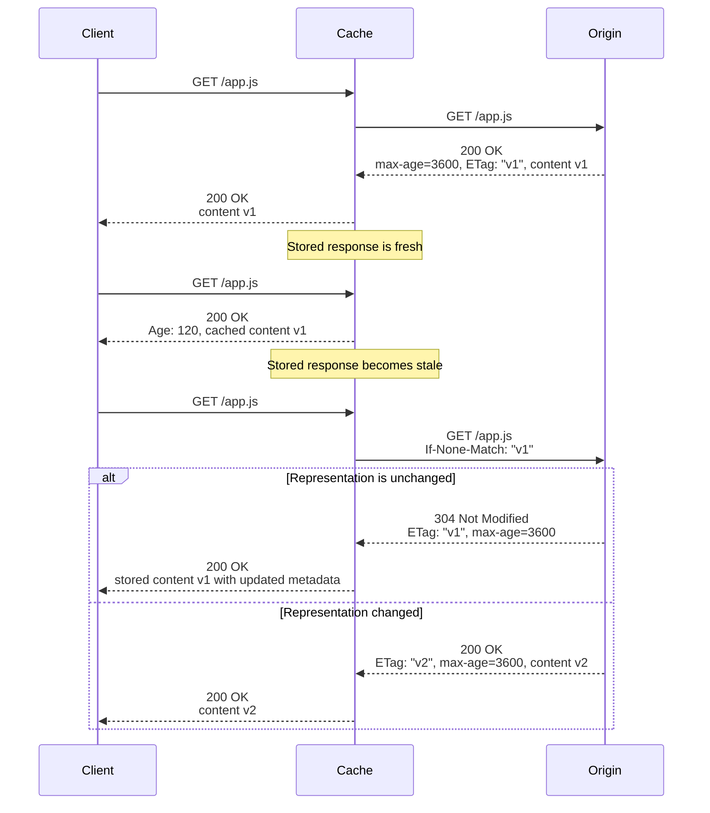

*Hypertext Transfer Protocol* (HTTP) is a stateless application-layer protocol for exchanging messages between clients and servers. A client sends a request that identifies a resource and an intended operation; the server returns a response describing the result.

HTTP defines the semantics of requests and responses, not how packets are routed or lost data is retransmitted. Those concerns belong to lower layers.

The same core concepts apply across HTTP versions:

- A *resource* is the target of a request and is usually identified by a URI.
- A *representation* is the current or intended state of a resource in a particular format, such as JSON or HTML.
- A *method* states what the client wants to do with the resource.
- A *status code* states the result of the request.
- Header fields carry metadata and modify how a message is interpreted or handled.
- Content carries a representation or other data associated with the message.

HTTP/1.1, HTTP/2, and HTTP/3 preserve these semantics. Their main differences are how messages are encoded, multiplexed, and transported.

## Messages

An *HTTP message* is either a request or a response. HTTP/1.x represents each message as a start line, header fields, a blank line, and optional content.

### Requests

An HTTP/1.x request starts with a *request line* containing a method, request target, and HTTP version. The following request asks the server to create a product:

```http
POST /products HTTP/1.1
Host: example.com
Content-Type: application/json
Content-Length: 31

{"title":"Network Programming"}
```

The blank line terminates the header section even when the request has no content. Request content can use any media type understood by the application, such as JSON, form data, or a binary format.

The *request target* identifies where the request should be applied. HTTP/1.1 defines four forms:

1. *Origin form* contains an absolute path and optional query, such as `/products?category=books`. Clients use it for most requests to an origin server. The `Host` field supplies the URI's authority.
2. *Absolute form* contains the complete target URI, such as `http://example.com/products?category=books`. Clients use it when sending a request to a proxy that needs to identify the origin server.
3. *Authority form* contains only a host and port, such as `example.com:443`. It is used only with `CONNECT`, which asks a proxy to establish a tunnel to that authority.
4. *Asterisk form* contains only `*`. It is used only with `OPTIONS` to address the server as a whole, as in `OPTIONS * HTTP/1.1`.

If the target URI has an empty path, a client using origin form sends `/`. A URI fragment isn't part of the request target because fragments are interpreted by the client rather than sent to the server.

### Responses

An HTTP/1.x response starts with a *status line* containing the HTTP version, status code, and an optional *reason phrase*. The server can respond to the product request as follows:

```http
HTTP/1.1 201 Created
Location: /products/42
Content-Type: application/json
Content-Length: 39

{"id":42,"title":"Network Programming"}
```

The reason phrase, such as `Created`, is human-readable text and doesn't determine the response's meaning. The status code carries the response semantics.

The `Content-Type` field describes how to interpret the content. `Content-Length` provides its size in bytes and therefore helps delimit an HTTP/1.x message. When the size isn't known before transmission, HTTP/1.1 can instead use *chunked transfer coding* to send a sequence of size-prefixed chunks terminated by a zero-length chunk.

> Chunked transfer coding frames content for transport. It doesn't compress it. *Content compression* is negotiated separately with fields such as `Accept-Encoding` and `Content-Encoding`.

### Pseudo-Headers

HTTP/2 and HTTP/3 don't transmit textual request or status lines. They represent the same control information with *pseudo-header fields* at the beginning of a header block:

- `:method` contains the request method.
- `:scheme` contains the target URI's scheme, commonly `https`.
- `:authority` contains the target URI's authority, usually its host and optional port.
- `:path` contains the target URI's path and optional query.
- `:status` contains the response status code and appears only in responses.

For example, the product request has the following conceptual HTTP/2 or HTTP/3 representation:

```http
:method: POST
:scheme: https
:authority: example.com
:path: /products
content-type: application/json
content-length: 31

{"title":"Network Programming"}
```

This allows HTTP/2 to compress the header block with HPACK, while HTTP/3 uses QPACK. Pseudo-header fields must appear before ordinary header fields and aren't valid HTTP/1.x field names.

## Methods

An HTTP method expresses the semantic intent of a request. Standard methods have consistent meanings across resources, although each resource decides which methods it supports.

Two method properties affect automation and retries:

- A *safe* method has read-only semantics. The server can still log or meter the request, but the client didn't ask it to change the resource's state.
- An *idempotent* method has the same intended effect whether an identical request is made once or several times. Its responses don't have to be identical.

The common methods have the following semantics:

| Method | Intent | Safe | Idempotent |
| --- | --- | :---: | :---: |
| `GET` | Retrieve a current representation. | Yes | Yes |
| `HEAD` | Retrieve the same metadata as `GET` without response content. | Yes | Yes |
| `OPTIONS` | Retrieve communication options. | Yes | Yes |
| `QUERY` | Submit content for a safe query operation. | Yes | Yes |
| `PUT` | Replace the state of the target resource. | No | Yes |
| `DELETE` | Remove the association between the target URI and its current functionality. | No | Yes |
| `POST` | Ask the resource to process the supplied content according to its own semantics. | No | No |
| `PATCH` | Apply partial modifications to a resource. | No | No |

Safety and idempotency describe the method's defined semantics, not every possible implementation. An application can design a particular `POST` or `PATCH` operation to be idempotent, but clients and intermediaries can't assume that from the method alone.

> `QUERY` was standardized in [RFC 10008](https://www.rfc-editor.org/rfc/rfc10008.html). It provides safe, idempotent semantics for requests that need to carry query content, avoiding the undefined semantics of content in a `GET` request.

## Status Codes

An HTTP status code describes the result of a request. The first digit identifies its class:

| Class | Meaning |
| --- | --- |
| `1xx` | The request was received, and processing is continuing. |
| `2xx` | The request was successfully received, understood, and accepted. |
| `3xx` | The client needs to take further action, commonly following a redirect. |
| `4xx` | The request can't be fulfilled because of something attributable to the client. |
| `5xx` | The server failed to fulfill an apparently valid request. |

A client doesn't need to recognize every status code. It must still understand the class, so an unknown `471` response is handled like a `400` response.

> The [IANA HTTP Status Code Registry](https://www.iana.org/assignments/http-status-codes/http-status-codes.xhtml) lists registered status codes and their specifications.

## Header Fields

HTTP *header fields* carry message metadata and control information. Field names are case-insensitive, while each field defines the syntax and meaning of its value.

Common uses include:

- Describing content with `Content-Type`, `Content-Length`, and `Content-Encoding`.
- Selecting a representation with `Accept`, `Accept-Encoding`, and `Accept-Language`.
- Supplying [[Authentication|authentication credentials]] with `Authorization`.
- Redirecting a client with `Location`.
- Controlling caching with `Cache-Control`, `ETag`, and `Vary`.
- Transferring cookies with `Cookie` and `Set-Cookie`.

Header fields are extensible and mostly independent of the HTTP version. Connection-specific fields are an exception: fields such as `Connection` and `Transfer-Encoding` describe an HTTP/1.x connection and must not be forwarded into HTTP/2 or HTTP/3 unchanged.

## HTTP Versions

HTTP versions mostly differ in their wire format and transport behavior:

| Version | Usual transport | Message encoding | Main behavior |
| --- | --- | --- | --- |
| HTTP/1.0 | [[TCP]] | Text | One request per connection by default. |
| HTTP/1.1 | TCP | Text | Persistent connections by default; optional pipelining. |
| HTTP/2 | TCP | Binary frames | Multiplexed streams and HPACK header compression. |
| HTTP/3 | QUIC over UDP | Binary frames | Multiplexed streams without cross-stream transport blocking. |

### HTTP/0.9

HTTP/0.9 supported only `GET` and returned HTML without headers or status codes. This was enough to retrieve a simple document, but it couldn't describe failures, identify other content types, carry metadata, or submit data.

### HTTP/1.0

HTTP/1.0 added status codes, header fields, and methods beyond `GET`.

#### Non-Persistent Connections

A *non-persistent connection* carries one request-response exchange and then closes. HTTP/1.0 uses non-persistent connections by default, so fetching an HTML document and its referenced image requires two TCP connections:



Ignoring server processing time and the small transmission times of the handshake and request, fetching one resource this way takes approximately two [[Network Performance|round-trip times (RTTs)]] plus the response transmission time: one RTT to establish TCP and another for the request to reach the server and the response to begin returning.

For $n$ resources fetched sequentially over separate connections, the approximate time is:

$$
\sum_{i=1}^{n} (2 \operatorname{RTT} + T_i)
$$

Here, $T_i$ is the transmission time of resource $i$.

#### Keep-Alive Extension

Later HTTP/1.0 implementations introduced the *Keep-Alive extension*, which allowed a connection to carry more than one request-response exchange. The client requests reuse with `Connection: keep-alive`:

```http
GET /health HTTP/1.0
Host: example.com
Connection: keep-alive
```

The server opts in by returning the same connection option and can advertise intended limits:

```http
HTTP/1.0 200 OK
Content-Type: text/plain
Content-Length: 2
Connection: keep-alive
Keep-Alive: timeout=5, max=100

OK
```

`Connection` and `Keep-Alive` describe one transport connection rather than the end-to-end request, so an intermediary must consume them instead of forwarding them unchanged. Either endpoint can still close the connection earlier than advertised.

Connection reuse also means that closure can no longer delimit every response. A message therefore needs another valid boundary, such as `Content-Length`. HTTP/1.1 standardized persistent connections and added chunked transfer coding for content whose size isn't known in advance.

> HTTP specifies the conditions for connection reuse and closure. An HTTP implementation performs the underlying TCP operations needed to follow those semantics.

### HTTP/1.1

HTTP/1.1 standardized connection reuse, pipelining, and chunked transfer coding, and introduced important caching features such as `Cache-Control`, ETags, and conditional requests.

#### Persistent Connections

A *persistent connection* can carry several request-response exchanges. Unlike HTTP/1.0 Keep-Alive, HTTP/1.1 doesn't require the endpoints to negotiate reuse before each connection can remain open. A server can still close a connection when necessary, and clients must handle unexpected closure.

With sequential requests on one persistent connection, the TCP setup is paid once:

$$
\operatorname{RTT} + \sum_{i=1}^{n} (\operatorname{RTT} + T_i)
$$

The following sequence shows the persistent connection being reused after the browser parses the HTML:



#### Pipelining

*HTTP/1.1 pipelining* allows a client to send several requests without waiting for each response. The server must return the corresponding responses in request order:



This reduces the request phase from one RTT per object to approximately one RTT for the batch.

##### Head-of-Line Blocking

However, pipelining suffers from *HTTP head-of-line (HOL) blocking*: If the first response is slow, completed later responses wait behind it. HTTP/1.1 can't interleave response content from different requests, so bytes from a later response can't pass an earlier response on the same connection.

For example, a slow image response can block a stylesheet and script requested after it:



In the example above, the script could've been executed while waiting for image response.

#### Parallel Connections

Browsers historically avoided relying on pipelining by opening several connections to an origin. Each connection has its own response queue, so a slow response on one connection doesn't block responses on the others.

*Parallel connections* trade blocking for extra TCP and [[Transport Layer Security|TLS]] handshakes, sockets, congestion-control state, and server resources. Browsers therefore limit the number of simultaneous connections to an origin, commonly six connections per origin.

*Domain sharding* was a technique to bypass this limit. It spread resources across origins such as `www.example.com`, `static1.example.com`, and `static2.example.com` to obtain more connection pools.

#### Bundling and Sprite Sheets

*Bundling* combines several resources into one larger resource. For example, a build tool can combine `header.js`, `menu.js`, `footer.js`, and `cart.js` into `bundle.js`. The browser makes one request instead of four, reducing request overhead and the number of RTTs needed when pipelining isn't used.

Bundling was especially useful because browser support for HTTP/1.1 pipelining was poor and parallel connections were limited. However, changing one module can invalidate the entire bundle, and a page may download code that it doesn't need, making caching and deployment less granular.

*Sprite sheets* apply the same idea to images. Many icons are packed into one larger image, and CSS uses the element's dimensions and background position to display only the required region. This reduces image requests, but changing one icon can invalidate the whole sprite sheet and maintaining its coordinates adds build complexity.

### HTTP/2
<!-- TODO: Dive deeper into HTTP2 -->

HTTP/2 preserves HTTP semantics, while replacing HTTP/1.1's textual wire format with a binary framing layer.

#### Multiplexing and Header Compression

An HTTP/2 *frame* is the smallest unit of communication within an HTTP/2 connection. Each request-response exchange uses a *stream*, and every frame identifies the stream to which it belongs. Frames from several streams can therefore be interleaved on one connection:



This *multiplexing* removes the HTTP/1.1 requirement to finish one response before sending another. It doesn't make the connection physically parallel; bytes still travel serially, but the sender can alternate among streams.

HTTP/2 uses HPACK to compress header blocks. This *header compression* is separate from content compression: HPACK compresses fields such as `Cookie` and `Accept-Encoding`, while `Content-Encoding: gzip` or `Content-Encoding: br` describes compressed content.

#### TCP-Level Head-of-Line Blocking

HTTP/2 still inherits TCP's ordering guarantee. If a TCP segment is lost, TCP withholds all later bytes until the missing segment is retransmitted, even when those bytes belong to other HTTP/2 streams. HTTP-level head-of-line blocking is gone, but *TCP-level head-of-line blocking* remains.

#### Server Push

Multiplexing makes discovered resources cheaper to request, but the browser still can't request a resource until it learns that the resource is needed. HTTP/2 standardized optional *server push*, which lets a server preemptively send a resource that it expects the client to need. A client can disable push with `SETTINGS_ENABLE_PUSH`, and it can cancel an unwanted promised stream. Server push is difficult to use well because the server might push something the client already has cached, wasting bandwidth. Although it remains an optional HTTP/2 feature, major browsers have disabled or removed support for it; `rel="preload"` and `103 Early Hints` are commonly used alternatives.

### HTTP/3
<!-- TODO: Dive deeper into HTTP3 -->

#### QUIC

HTTP/3 carries HTTP over QUIC instead of TCP. QUIC provides multiple independent, reliable streams over UDP. Packet loss affecting one stream doesn't prevent HTTP from processing data that has already arrived for another stream.

QUIC integrates transport security using TLS 1.3 and combines transport and cryptographic handshakes. It also identifies a connection independently of the endpoint's current IP address and port, allowing a connection to survive some network changes, such as moving between Wi-Fi and mobile data.

HTTP/3 uses QPACK instead of HPACK. QPACK is designed so that header compression can remain efficient without reintroducing unnecessary blocking between QUIC streams.

> QUIC removes head-of-line blocking between streams, not within a stream. Losing data from one stream still delays later data on that same stream.

## Caching

An *HTTP cache* applies the general mechanisms described in [[Caching]] to stored HTTP responses. HTTP fields control whether a response may be stored, how long it is fresh, and how a stale response can be validated.

### Cache Types

HTTP's formal distinction is based on how many users a cache serves. A *shared cache* stores responses for reuse by more than one user. Terms such as proxy cache and managed cache describe how a shared cache is deployed and controlled rather than defining additional protocol-level cache types.

- A *private cache* serves one client. A browser cache is the usual example. It can store a personalized response because that response won't be reused for other users.
- A *proxy cache* is an intermediary that the service operator generally doesn't control. HTTP headers are therefore the main way an origin communicates its caching policy to the proxy.
- A *managed cache* is deliberately controlled by the service operator, commonly through a CDN or caching reverse proxy. The operator can configure it using HTTP fields as well as product-specific rules, invalidation APIs, or dashboards.

### Cache Keys and Variants

The request method and target URI form the basis of an HTTP *cache key*. The selected representation can also depend on request fields. For example, a server might choose a language from `Accept-Language` or a compression format from `Accept-Encoding`.

The `Vary` response field identifies the request fields that affected this selection:

```http
HTTP/1.1 200 OK
Content-Type: text/html
Content-Encoding: br
Vary: Accept-Encoding
```

A cache can reuse this response only for a request whose relevant `Accept-Encoding` value matches. Without `Vary`, the cache could incorrectly send Brotli-compressed content to a client that didn't advertise support for it.

### Freshness

A stored response is *fresh* while its *current age* is less than its *freshness lifetime*:

$$
\operatorname{fresh} = \operatorname{current\ age} < \operatorname{freshness\ lifetime}
$$

A fresh response can normally satisfy a request without contacting the origin. Once its age reaches the freshness lifetime, it becomes *stale*.

> Stale doesn't mean unusable or deleted; it means that reuse normally requires validation or explicit permission to serve stale content.

#### Freshness Lifetime

A cache determines the freshness lifetime from the first applicable source:

1. A shared cache uses `s-maxage` when present.
2. Otherwise, the cache uses `max-age` when present.
3. Otherwise, it uses the difference between `Expires` and `Date` when both provide valid timestamps.
4. Otherwise, it may calculate a heuristic lifetime when the response permits heuristic caching.

When no explicit lifetime is present, a cache may derive *heuristic freshness* from other metadata, commonly `Last-Modified`, but HTTP doesn't prescribe a single formula.

> HTTP/1.0 used `Expires` to set freshness as an absolute date and time. HTTP/1.1's `Cache-Control: max-age` uses elapsed time instead and is generally preferred because it is less vulnerable to clock discrepancies and parsing problems.

#### Serving Stale Responses

A cache normally validates a stale response before reusing it. Stale reuse is allowed only in defined circumstances, including:

- A request permits it with a directive such as `max-stale`.
- A response permits it through an extension such as `stale-while-revalidate` or `stale-if-error`.
- The cache is disconnected and no directive such as `must-revalidate` prohibits stale reuse.
- An explicit configuration or contract permits it.

`must-revalidate` means that a stale response can't be reused without successful validation. This matters when an unavailable origin is less harmful than serving outdated data, such as for account balances or authorization decisions.

### Revalidation

*Revalidation* asks whether a stored response can still represent the resource. A *validator* is response metadata, such as an ETag or modification date, that a cache returns in a *conditional request*. If the representation is unchanged, the origin sends `304 Not Modified` without retransmitting the content.

The following sequence shows an initial cache fill, a fresh cache hit, and the two possible revalidation outcomes:



#### Entity Tags

An *entity tag* (ETag) is an opaque validator chosen by the origin. It can represent a content hash, version number, or another value meaningful to the implementation:

```http
HTTP/1.1 200 OK
Cache-Control: max-age=3600
ETag: "v1"
Content-Type: text/javascript
```

After the response becomes stale, a cache sends the tag in `If-None-Match`:

```http
GET /app.js HTTP/1.1
Host: example.com
If-None-Match: "v1"
```

For this `GET` request, the server compares `"v1"` with the current ETag. If they match, it returns `304 Not Modified` without content; otherwise, it returns `200 OK` with the current content and its new ETag.

#### Modification Dates

`Last-Modified` records the origin's modification time. A cache returns it through `If-Modified-Since`:

```http
GET /index.html HTTP/1.1
Host: example.com
If-Modified-Since: Tue, 22 Feb 2022 22:00:00 GMT
```

For this `GET` request, the server checks whether the resource was modified after the supplied timestamp. If it wasn't, the server returns `304 Not Modified` without content; otherwise, it returns `200 OK` with the current content and an updated `Last-Modified` value.

### Storage Directives

Three commonly confused response directives have different effects:

| Directive | Effect |
| --- | --- |
| `private` | Allows storage by a private cache but not a shared cache. |
| `no-cache` | Allows storage but requires validation before reuse. |
| `no-store` | Instructs caches not to store the response. |

### Cache Busting

HTTP *cache busting* changes a resource's URL whenever its content changes. For versioned static assets, a content hash in a filename such as `app.33a64df5.js` creates a new cache key whenever the content changes. 

This allows a long-lived policy such as the following without making deployments serve an old asset at the same URL:

```http
Cache-Control: public, max-age=31536000, immutable
```

## Cookies

HTTP is stateless: a server can't infer that two requests belong to the same application session merely because they use the same connection. A *cookie* is a small piece of state that a server asks a user agent to store and return with later matching requests.

The server creates or updates a cookie with `Set-Cookie`:

```http
Set-Cookie: session_id=opaque-value; Path=/; Secure; HttpOnly; SameSite=Lax
```

The browser later sends matching cookies in the `Cookie` request field:

```http
Cookie: session_id=opaque-value
```

The browser owns the cookie store and decides which cookies match a request. JavaScript can't set the `Cookie` request field directly.

### Lifetime

Cookie lifetime can be session-based or persistent:

- A *session cookie* omits both `Expires` and `Max-Age`. The browser removes it when the current session ends, although session restoration can preserve it across a browser restart.
- A *persistent cookie* supplies an absolute expiration time with `Expires` or a lifetime in seconds with `Max-Age`. The browser can retain it across sessions until it expires or is deleted.

The following fields create persistent cookies using each expiry mechanism:

```http
Set-Cookie: theme=dark; Expires=Thu, 31 Oct 2030 07:28:00 GMT
Set-Cookie: language=en; Max-Age=2592000
```

When both attributes are present, `Max-Age` takes precedence. To delete a cookie immediately, the server sets it again with the same name, domain, and path and gives it a `Max-Age` of zero or less:

```http
Set-Cookie: theme=dark; Max-Age=0
```

### Scope

`Domain` and `Path` control when the browser sends a cookie:

- Without `Domain`, a cookie is a *host-only cookie* and isn't sent to subdomains.
- With `Domain=example.com`, it can be sent to `example.com` and its subdomains.
- With `Path=/docs`, it is sent only when the request path matches `/docs` or one of its subpaths.

### Security Attributes

Cookie values are client-controlled input. A server must validate them and perform [[Authorization|authorization]] against trusted state. In [[Session-Based Authentication|session-based authentication]], cookies usually contain an opaque identifier rather than sensitive application data.

- `Secure` restricts the cookie to secure connections.
- `HttpOnly` prevents browser scripts from reading the cookie while still allowing the browser to send it in HTTP requests.
- `SameSite` controls whether the cookie is sent with cross-site requests.

The `SameSite` values trade cross-site functionality for protection:

| Value | Behavior |
| --- | --- |
| `Strict` | Sends the cookie only with same-site requests. |
| `Lax` | Also sends it on limited top-level cross-site navigations that use a safe method. |
| `None` | Sends it with same-site and cross-site requests; requires `Secure`. |

`SameSite` mitigates many *cross-site request forgery* (CSRF) attacks.
