*Transmission Control Protocol* (TCP) provides a reliable, ordered, bidirectional byte stream between two endpoints. It runs above IP and hides packet loss, duplication, and reordering from applications by acknowledging received bytes and retransmitting missing data.

A TCP connection is identified by a *four-tuple*: source IP address, source port, destination IP address, and destination port.

## Data Model

### Byte Streams and Segments

TCP exposes a byte stream rather than a message interface. If an application performs two writes:

```text
send("HELLO")
send("WORLD")
```

The receiver observes the same ordered byte sequence, `HELLOWORLD`, but its reads don't have to match the sender's writes. All of the following are valid:

```text
recv() -> "HELLOWORLD"

recv() -> "HELLO"
recv() -> "WORLD"

recv() -> "HEL"
recv() -> "LOWOR"
recv() -> "LD"
```

Applications must therefore define their own message boundaries, such as a fixed size, delimiter, or length prefix.

TCP divides the byte stream into *segments* for transmission. The *maximum segment size* (MSS) is the largest amount of TCP payload an endpoint agrees to receive in one segment. It excludes the TCP and IP headers. An MSS of 1,460 bytes is common with a 1,500-byte maximum transmission unit (MTU), a 20-byte IPv4 header, and a 20-byte TCP header.

### TCP Header

The TCP header carries addressing, sequencing, control, and integrity information. Its fixed portion is 20 bytes, and TCP options can extend it to 60 bytes. The following packet diagram shows only the fixed 20-byte portion:

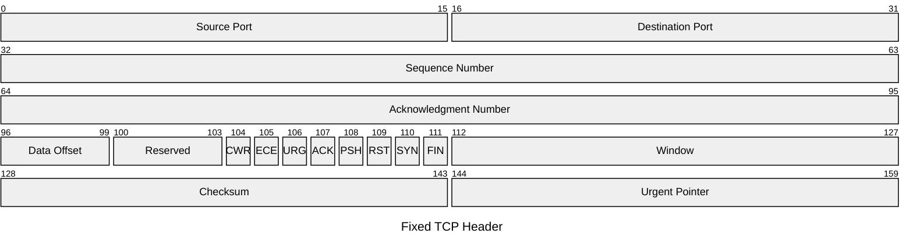

The data offset gives the complete header length in 32-bit words. It therefore determines where application data begins:

$$
\operatorname{DataStart} = \operatorname{DataOffset} \times 32\ \text{bits}
$$

The minimum data offset is 5, so a segment without options has a 160-bit (20-byte) header and its data begins at bit 160. When the data offset is greater than 5, options and padding occupy the region between the fixed header and the indicated data position. The maximum data offset is 15, allowing a 480-bit (60-byte) header with up to 40 bytes of options and padding.

The currently assigned control flags are `CWR`, `ECE`, `URG`, `ACK`, `PSH`, `RST`, `SYN`, and `FIN`; the four bits before them are reserved. TCP options carry features such as MSS, window scaling, timestamps, and SACK information.

## Reliable Delivery

### Sequence and Acknowledgment Numbers

TCP numbers bytes, not segments. Each direction has an independent sequence-number space because both peers can send data.

The *sequence number* identifies the first payload byte in a segment. The *acknowledgment number* identifies the next byte that the receiver expects. For an in-order segment with sequence number $S$ and payload length $L$, the resulting acknowledgment is:

$$
A = S + L
$$

The following example shows how the payload length determines the acknowledgment number:

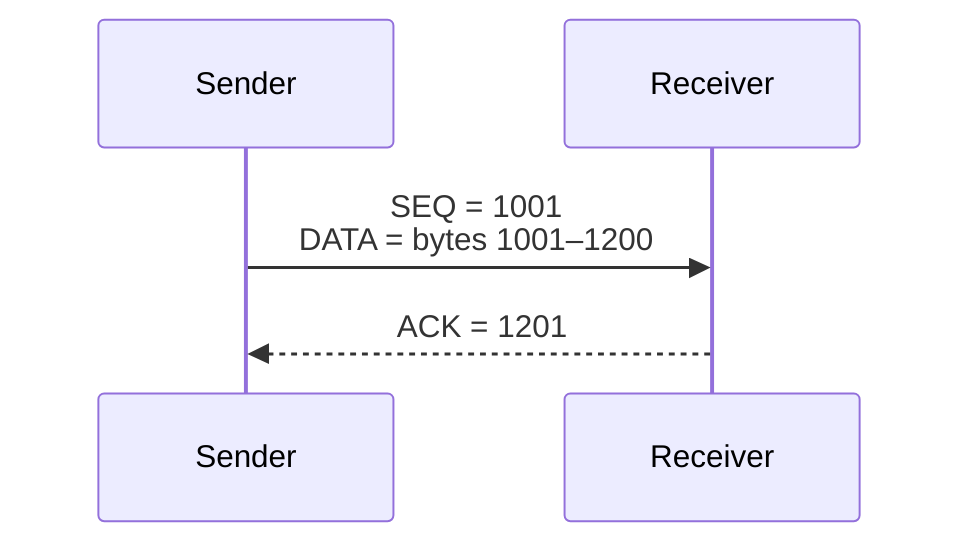

Acknowledgments are *cumulative*: one acknowledgment can confirm bytes received across several segments. The following example uses one ACK to confirm two contiguous segments:

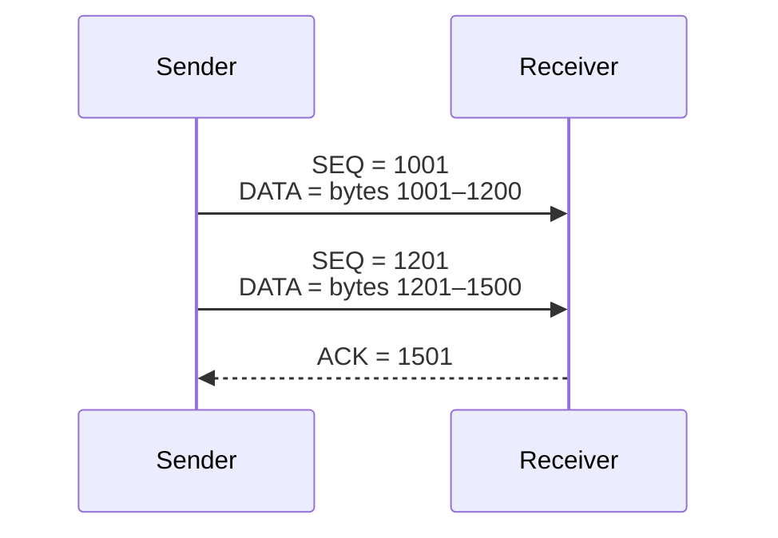

The acknowledgment confirms that every byte before $1{,}501$ has arrived in order.

Sequence and acknowledgment numbers are 32-bit unsigned values, giving $2^{32} = 4{,}294{,}967{,}296$ positions before they wrap. TCP compares them using serial-number arithmetic rather than ordinary integer ordering.

> Because TCP tracks a byte stream, an acknowledgment can cover part of the data originally sent in a segment. If a sender transmits 500 bytes beginning at sequence number $1$ and receives acknowledgment number $301$, bytes $1$ through $300$ are confirmed. The sender retains the unacknowledged bytes beginning at sequence number $301$ and can resegment them for later transmission; retransmissions don't have to reproduce the original segment boundary.

### Retransmission Timeout

The *retransmission timeout* (RTO) is how long a sender waits for acknowledgment progress before retransmitting the earliest unacknowledged segment. The sender retains unacknowledged bytes so that it can retransmit them, then removes bytes from this state as cumulative acknowledgments confirm their receipt. Repeated timeouts use exponential backoff, preventing the sender from retrying continuously at a fixed short interval.

The following diagram shows timeout-based recovery when the original segment is lost:

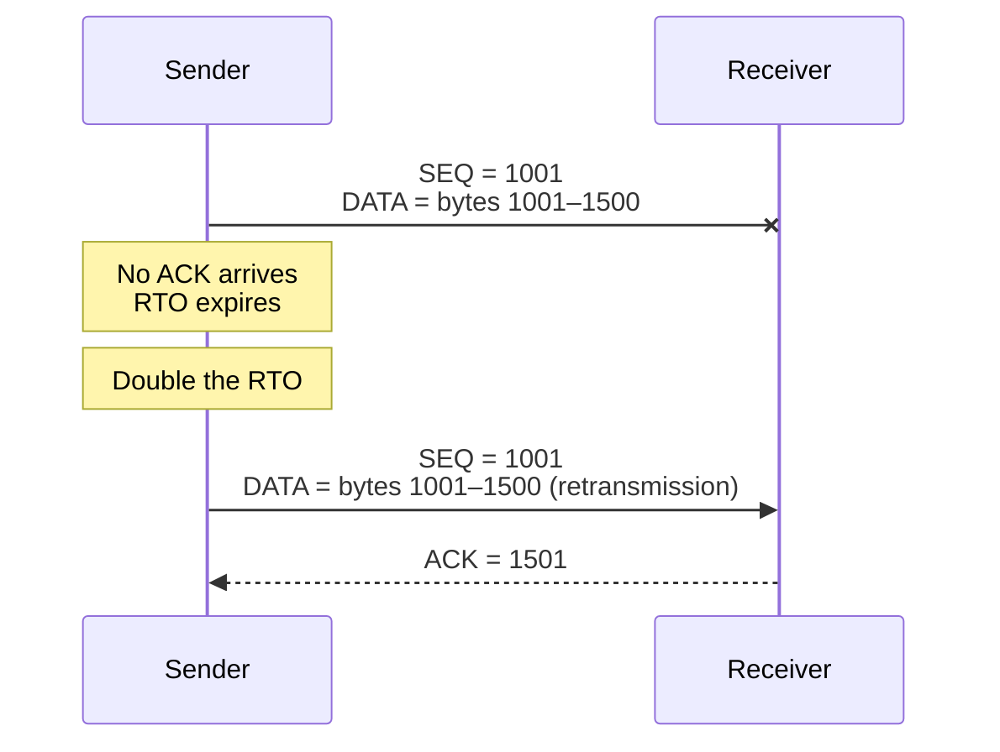

TCP adapts the RTO to the connection's measured round-trip time (RTT). An RTT measurement $R$ is the elapsed time from sending a segment to receiving an acknowledgment that covers it. The sender takes at least one unambiguous RTT measurement per round trip when possible.

> *Karn's algorithm* says not to measure RTT $R$ from a retransmitted segment because a later acknowledgment might correspond to either the original transmission or the retry. The TCP timestamp option can remove this ambiguity by identifying which transmission produced the acknowledgment.

The sender maintains a smoothed round-trip time (SRTT) and round-trip time variation (RTTVAR):

$$
\operatorname{RTTVAR}
\leftarrow
(1 - \beta)\operatorname{RTTVAR}
+
\beta\left|\operatorname{SRTT} - R\right|
$$

$$
\operatorname{SRTT}
\leftarrow
(1 - \alpha)\operatorname{SRTT}
+
\alpha R
$$

$$
\operatorname{RTO}
\leftarrow
\operatorname{SRTT} + \max\left(G, 4 \times \operatorname{RTTVAR}\right)
$$

Here, $\operatorname{SRTT}$ represents the path's recent typical RTT, $\operatorname{RTTVAR}$ represents how much RTT measurements vary, and $G$ is the sender's clock granularity. The usual weights are $\alpha = 1/8$ and $\beta = 1/4$, so recent measurements adjust the estimates without discarding their history.

### Handling Delivery Anomalies

The following diagram shows how cumulative acknowledgments and retransmission handle four common delivery anomalies:


- Lost data prevents the cumulative ACK from advancing past the gap, causing retransmission after the RTO expires or earlier through fast retransmit.
- A lost acknowledgment may be covered by a later cumulative ACK; otherwise, the RTO causes a retransmission that the receiver safely recognizes as duplicate data.
- Out-of-order data is buffered or discarded while the cumulative ACK remains at the missing byte until the gap is filled.
- Duplicate data is discarded, and the receiver can repeat the ACK for the next byte it expects.

### Head-of-Line Blocking

TCP's ordering guarantee produces *[[HTTP|head-of-line blocking]]*. If one segment is lost, the receiver can't expose later bytes to the application until the missing range is retransmitted, even when those later bytes have already arrived.

This affects application protocols that multiplex independent streams over one TCP connection. For example, one lost TCP segment can temporarily block every [[HTTP|HTTP/2]] stream on that connection.

## Connection Lifecycle

A TCP connection is explicitly established before ordinary communication and remains tracked until it is closed or aborted.

### Establishing a Connection

Each peer chooses its own *initial sequence number* (ISN). The three-way handshake exchanges those numbers and confirms that both directions are ready:

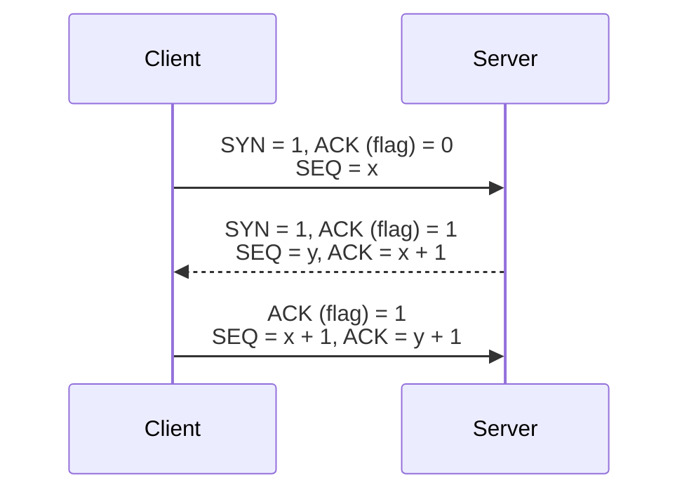

The ISN isn't always zero. Changing it between successive connections reduces the chance that a delayed segment from an older connection with the same four-tuple will be accepted as part of a new connection. Unpredictable ISNs also make off-path sequence-number guessing attacks harder.

The SYN segments carry TCP options that apply to the connection, including MSS, window scaling, and permission to use selective acknowledgments.

> Establishing TCP costs one RTT: the client can send application data with the handshake's final ACK rather than waiting for another exchange. TCP Fast Open is a separate extension that can allow data in the initial SYN.

#### Phantom Bytes

SYN consumes one position in the sequence-number space even when its segment contains no payload. This position is called a *phantom byte*, although no application byte is transmitted.

Without a phantom byte, both the SYN and the first payload byte would use sequence number $x$, even though they represent different events. An acknowledgment of the first payload byte couldn't be distinguished from an acknowledgment of the SYN.

Instead, TCP reserves sequence position $x$ for the SYN and begins data at $x + 1$. This creates an unambiguous boundary and lets SYN use the same sequence and acknowledgment machinery as application data.

### Closing a Connection

#### Graceful Closure

A FIN means that its sender has no more bytes to send. Like SYN, FIN consumes one phantom byte.

Because TCP is full-duplex, each direction closes independently. The peer can continue sending after it acknowledges the first FIN, producing a *half-closed connection*.

A graceful closure uses four control segments when neither side has more data to send. The following diagram expands that sequence to show the half-closed period in which B continues sending after A has closed its sending direction:

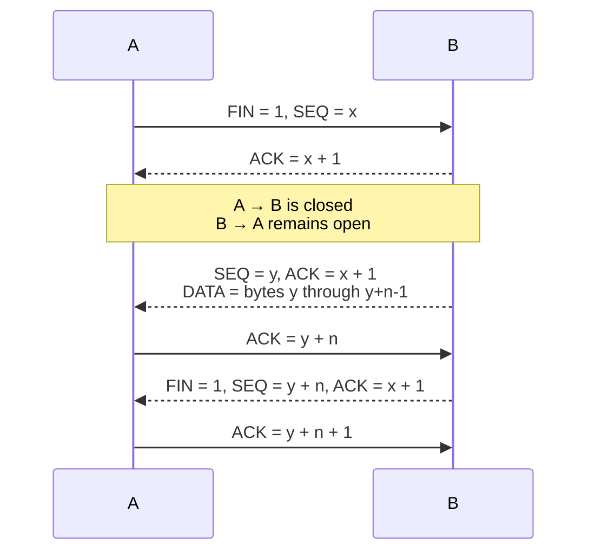

If B is ready to close immediately, it can combine its first ACK and FIN into one segment. A peer that has sent FIN must still receive and acknowledge data from the other direction, as A does in the diagram.

#### Reset

Either endpoint can send an RST to abort a connection immediately. It can indicate that no process is listening at the destination, that a segment doesn't belong to a valid connection, or that an endpoint deliberately abandoned the connection.

Unlike FIN, RST doesn't consume a sequence position or provide a graceful half-close. The receiver doesn't acknowledge the RST, and any buffered application data may be lost.

> For a packet-level walkthrough of sequence numbers, handshakes, and connection closure, see [Chris Greer's TCP fundamentals video](https://youtu.be/JFch3ctY6nE).

### TIME_WAIT

The endpoint that performs the active close and sends the final ACK normally enters *TIME_WAIT*. It retains a small kernel control record for twice the maximum segment lifetime (2MSL), conceptually long enough for old segments from the connection to disappear.

TIME_WAIT serves two purposes:

- It lets the endpoint resend the final ACK if the peer retransmits its FIN.
- It prevents delayed segments from an old connection from being confused with a new connection using the same four-tuple.

The application can no longer send or receive through the closed socket. TIME_WAIT reserves the relevant connection identity rather than disabling the local port globally. The same local port can still participate in connections with different remote endpoints, subject to operating-system rules.

## Flow and Congestion Control

TCP limits outstanding data to protect the receiving endpoint and the network path. Flow control and congestion control impose separate limits for these two concerns.

### Flow Control

*Flow control* prevents a fast sender from overwhelming the receiving host. The receiver advertises its available receive window (rwnd) in the TCP header. The sender limits its unacknowledged data (also called *data in flight*) according to that window.

The advertised window can change throughout the connection. A receiver that runs out of buffer space can advertise a zero window and later send a window update when space becomes available:

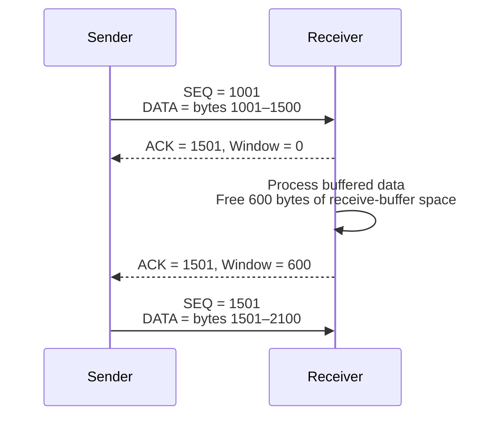

A zero window pauses ordinary transmission; it doesn't close the connection. The sender periodically sends window probes so that a lost window update doesn't leave both endpoints waiting forever.

#### Window Scaling

The TCP header's receive-window field is 16 bits, which limits an unscaled advertised window to 65,535 bytes. This can be too small to fill a high-bandwidth or high-latency path.

The *window-scale* option negotiated during the handshake applies a left shift to later advertised window values:

$$
\operatorname{EffectiveWindow} = \operatorname{WindowField} \times 2^{\operatorname{scale}}
$$

The scale ranges from 0 through 14, giving a maximum window of:

$$
65{,}535 \times 2^{14} = 1{,}073{,}725{,}440\ \text{bytes}
$$

Each endpoint advertises its own scale factor because the two receive buffers may differ. The option appears only in SYN segments, and it can't be enabled later for an established connection.

> The maximum scale is 14 because TCP has a 32-bit sequence-number space and must compare wrapped sequence numbers unambiguously. A receive window must remain below half of that space. Scale 14 keeps the largest advertised window near $2^{30}$ bytes, while scale 15 would approach $2^{31}$ bytes and violate that safety margin.

### Congestion Control

Flow control protects the receiver; *congestion control* protects the network path. The sender maintains a congestion window (cwnd) based on observed delivery and congestion signals. The amount of data in flight is bounded by the smaller of the receive and congestion windows:

$$
\operatorname{FlightLimit} = \min(\operatorname{rwnd}, \operatorname{cwnd})
$$

Classic loss-based congestion control has four broad behaviors:

1. *Slow start* increases cwnd rapidly as acknowledgments arrive, approximately doubling it during each RTT under ideal conditions.
2. *Congestion avoidance* continues with more cautious growth after a threshold.
3. Packet loss inferred from duplicate acknowledgments or an RTO acts as a congestion signal.
4. The sender reduces cwnd and adjusts its later growth.

The exact behavior depends on the congestion-control algorithm, such as Reno, CUBIC, or BBR. The following simplified graph shows rapid growth during slow start, slower growth during congestion avoidance, and an eventual limit imposed by receiver capacity:

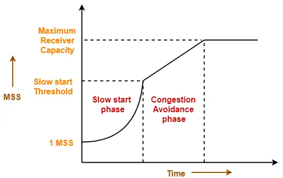

## Optional Mechanisms and Optimizations

### Delayed Acknowledgments

A receiver doesn't necessarily acknowledge every segment immediately. *Delayed acknowledgment* briefly postpones an ACK so that it can acknowledge multiple in-order segments or be combined with data traveling in the opposite direction.

The endpoints don't negotiate an exact delayed-ACK timer. The receiver chooses when to acknowledge, while the sender independently maintains its RTO. The receiver's maximum delay must be short enough to avoid causing unnecessary retransmissions.

The following diagram shows the two common outcomes after an in-order segment arrives:

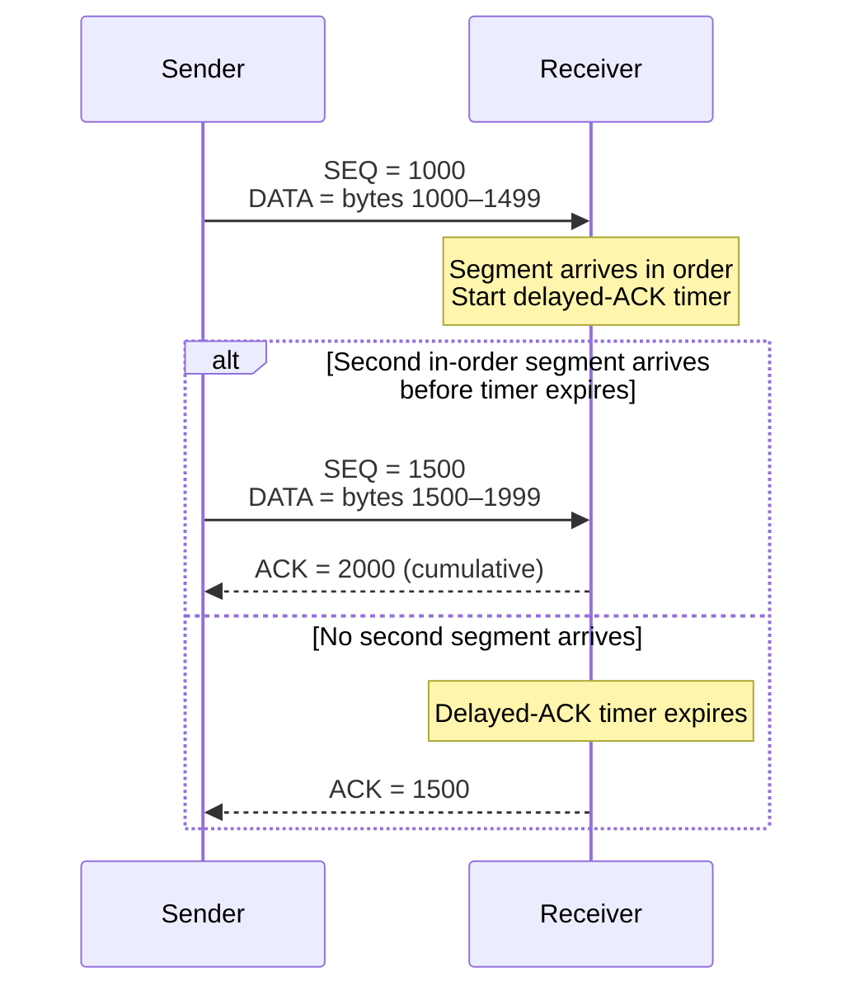

Exact policies and timing are implementation-dependent. A badly configured receiver that delays acknowledgments beyond the sender's RTO can cause spurious retransmissions, although duplicate data is discarded and the RTO backs off after repeated expiry.

RFC 1122 permitted a delayed ACK to wait as long as 500 ms and required an ACK for at least every second full-sized segment. Modern implementations often use much shorter adaptive delays.

### Fast Retransmit

When a receiver gets data above a gap, it repeats the acknowledgment number for the next missing byte. These *duplicate acknowledgments* tell the sender that later data is arriving while an earlier range is absent.

The following diagram shows later segments producing three duplicate ACKs after the first segment is lost:

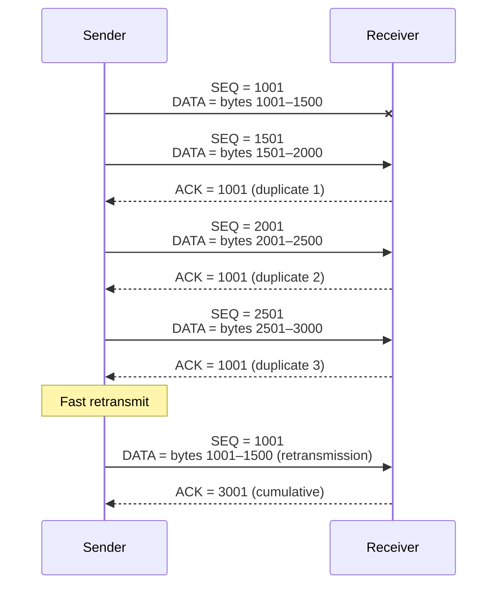

Classic fast retransmit infers loss after three duplicate acknowledgments (four acknowledgments with the same acknowledgment number when counting the original). It retransmits the missing segment without waiting for the RTO to expire.

### Selective Acknowledgments

Cumulative acknowledgments reveal the beginning of a gap but not all data received beyond it. The selective acknowledgment (SACK) option lets a receiver identify additional byte ranges that arrived successfully.

SACK lets the sender retransmit the missing ranges instead of unnecessarily resending later data. The peers advertise SACK support in their SYN options.

The following diagram shows SACK identifying received ranges around two gaps, allowing the sender to retransmit only the missing data:

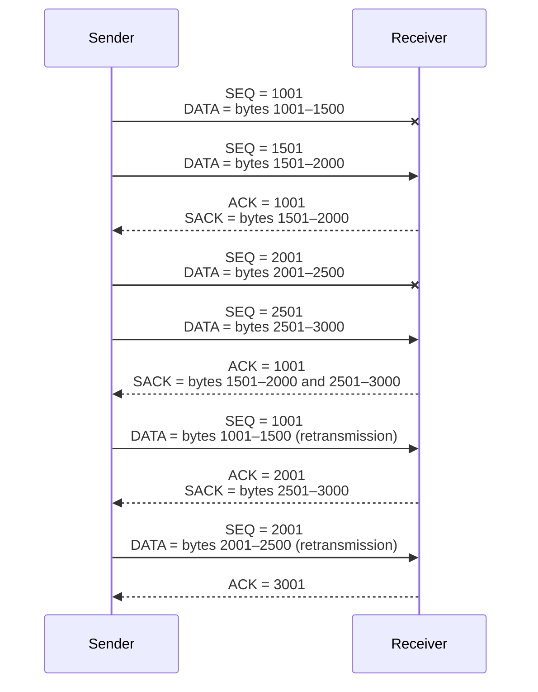

### Nagle's Algorithm

*Nagle's algorithm* reduces small-packet overhead by limiting how many small, unacknowledged segments a sender places on the network. After sending a small segment, the sender buffers later small writes until either the outstanding data is acknowledged or enough buffered data forms a full-sized segment.

The algorithm addresses the *small-packet problem*. With ordinary 20-byte IPv4 and 20-byte TCP headers, sending one payload byte can require a 41-byte packet before link-layer overhead. Workloads such as interactive terminal sessions can otherwise create many mostly empty packets, wasting bandwidth and contributing to congestion.

This behavior improves efficiency for applications that emit many tiny writes, but it can add latency. It interacts poorly with delayed acknowledgments when an application sends one small write, sends another small write, and then waits for a response:

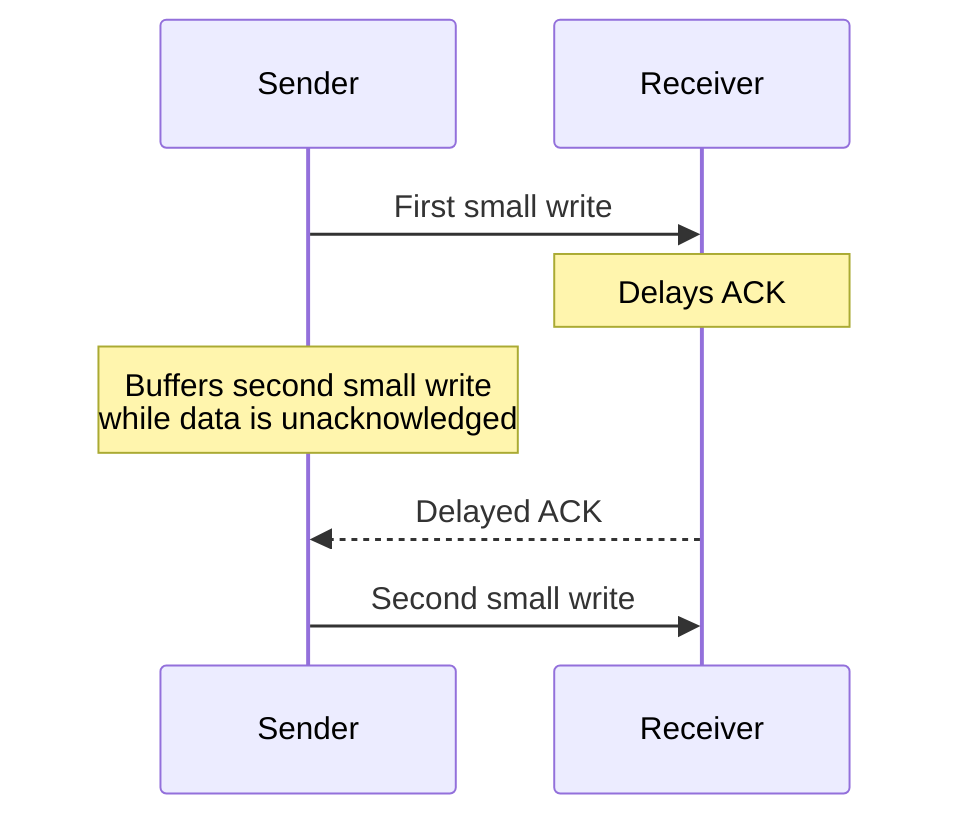

The receiver waits before acknowledging the first segment, while Nagle's algorithm prevents the second small segment from being sent.

Latency-sensitive applications may disable Nagle's algorithm with an option such as `TCP_NODELAY`, but doing so can increase packet overhead.

### TCP Keepalive

TCP keepalive detects a peer that becomes unreachable while an established connection is otherwise idle. When enabled, the local stack sends probes after a configurable idle period and closes the connection if repeated probes receive no response.

A connection for which one endpoint has disappeared without completing TCP closure is commonly called *half-open*. This isn't the same as a deliberately half-closed connection, where one direction has been closed with FIN while the other remains usable.
