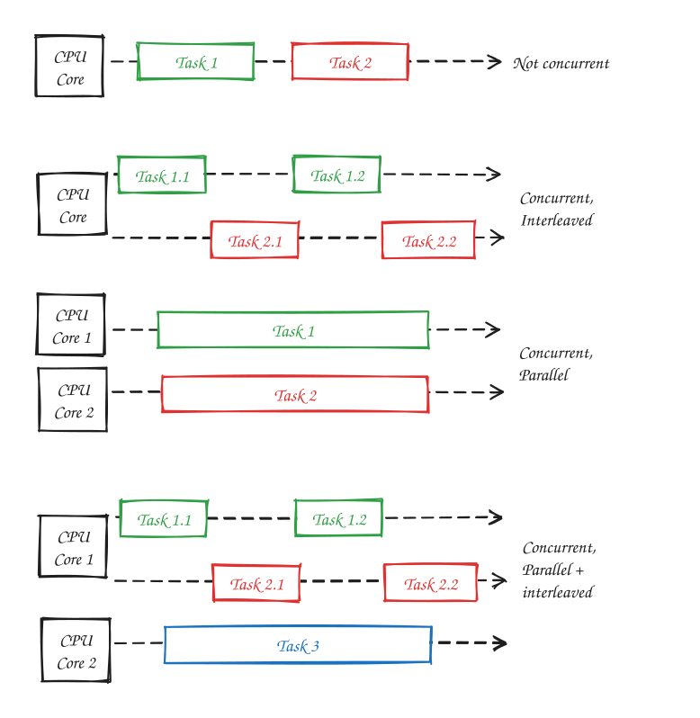

# Concurrency

Concurrency is the broader problem of managing multiple tasks whose execution overlaps in time. This encapsulates both interleaving execution (switching between tasks) and parallel execution (running tasks simultaneously on different cores.)

> "Concurrency is about dealing with lots of things at once. Parallelism is about doing lots of things at once." - Rob Pike

## Interleaving Execution

Interleaving execution allows multiple tasks to make progress on a single CPU core by switching between them.

> Useful for I/O-bound workflows.

Common examples include:

- Operating system thread scheduling
- Event loops
- Async/await
- Coroutines

## Parallel Execution

Parallel execution allows multiple tasks to execute simultaneously on different CPU cores or processors. Unlike interleaving, more than one task is actively running at the same instant.

> Useful for CPU-bound workflows.

## Note on Definitions

The term "concurrency" is overloaded.

Some sources define concurrency narrowly as interleaved execution achieved through context switching, i.e. our definition of "interleaving".

Others define concurrency more broadly as managing multiple tasks whose lifetimes overlap, making both interleaving and parallelism mechanisms for achieving concurrency, i.e. our definition of "concurrency".

Obviously, this note uses the second (broader) definition, which aligns well with [Sun's Multithreaded Programming Guide](https://docs.oracle.com/cd/E19455-01/806-5257/6je9h032b/index.html), [Wikipedia's definition](https://en.wikipedia.org/wiki/Concurrency_(computer_science)), and [Rob Pike's definition](https://www.youtube.com/watch?v=oV9rvDllKEg).

## Relationship to Threads, Processes, and CPU Cores

Interleaving and parallelism describe **execution patterns**, whereas threads, processes, and CPU cores describe **execution mechanisms/resources**.

- Threads and processes can be interleaved.
- Threads and processes can be executed in parallel.
- Multiple CPU cores enable parallel execution.
- Multiple threads or processes do not imply parallelism.
